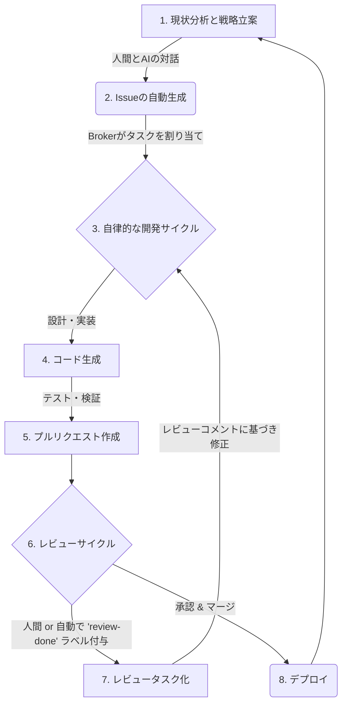

# GitHub Broker

**人間とAIの対話を通じてプロダクト開発を駆動させる、自律型AIエージェントチームのためのフレームワーク**

---

## コンセプト

GitHub Brokerは、人間とAI（特にPRODUCT_MANAGERエージェント）との戦略的な対話を通じて、開発の方向性を決定し、具体的なIssueを生成します。そして、そのIssueに基づき、自律的なAI開発エージェントチームが設計、実装、テストを自動で実行する、新しいプロダクト開発の形を実現するためのフレームワークです。

## プロジェクトのビジョン

私たちは、**人間とAIの協調による、高速で自律的な開発サイクル**の実現を目指しています。

人間はより創造的で戦略的な意思決定に集中し、AIは具体的な実装タスクを効率的に処理することで、プロダクトの価値を最大化し、市場投入までの時間を劇的に短縮します。

## 登場人物

本プロジェクトにおける主要な役割です。

-   **人間 (Human):** プロダクトの全体的なビジョンやビジネス目標を提示し、AIとの対話を通じて戦略を洗練させます。
-   **PRODUCT_MANAGER (AI):** 人間との対話を通じて戦略を理解し、具体的な開発タスク（GitHub Issues）に分解します。プロジェクト全体の進捗を管理する役割も担います。
-   **開発エージェントチーム (AI):** 各Issueに対して、設計、コーディング、テスト、プルリクエスト作成までを自律的に行います。

## 主要なユースケース（ワークフロー）

GitHub Brokerは以下のワークフローを通じて、アイデアをコードに変換します。特に、人間がプルリクエストをレビューする際に、そのコメントに基づいてAIへコードの修正を依頼する協調的なプロセスが加わりました。

このサイクルを通じて、継続的なプロダクト改善が自律的に行われます。人間は戦略的な判断と最終承認を行い、AIは実装と修正のサイクルを高速で回すことで、開発プロセス全体の効率と品質を向上させます。

## アーキテクチャ概要

本システムは、Clean Architectureに基づいた疎結合なコンポーネントで構成されています。全体のシステム構成やコンポーネント間の連携については、以下のC4モデル図を参照してください。

-   [**System Context Diagram**](./docs/architecture/system_context.md)

詳細なコードの構成については、[Code Overview](./docs/architecture/code-overview.md)をご覧ください。

## Getting Started

プロジェクトをローカル環境でセットアップし、実行するための詳細な手順については、以下の公式ガイドを参照してください。

-   [**Getting Started Guide**](./docs/guides/getting-started.md)

このガイドには、必要なツールのインストール、依存関係のセットアップ、およびシステムの基本的な実行方法が含まれています。

## Contributing

本プロジェクトへの貢献に興味を持っていただきありがとうございます！
バグ報告、機能提案、プルリクエストなど、あらゆる形の貢献を歓迎します。

詳細は [CONTRIBUTING.md](./CONTRIBUTING.md) をご覧ください。

## License

このプロジェクトは [MIT License](./LICENSE) の下で公開されています。
