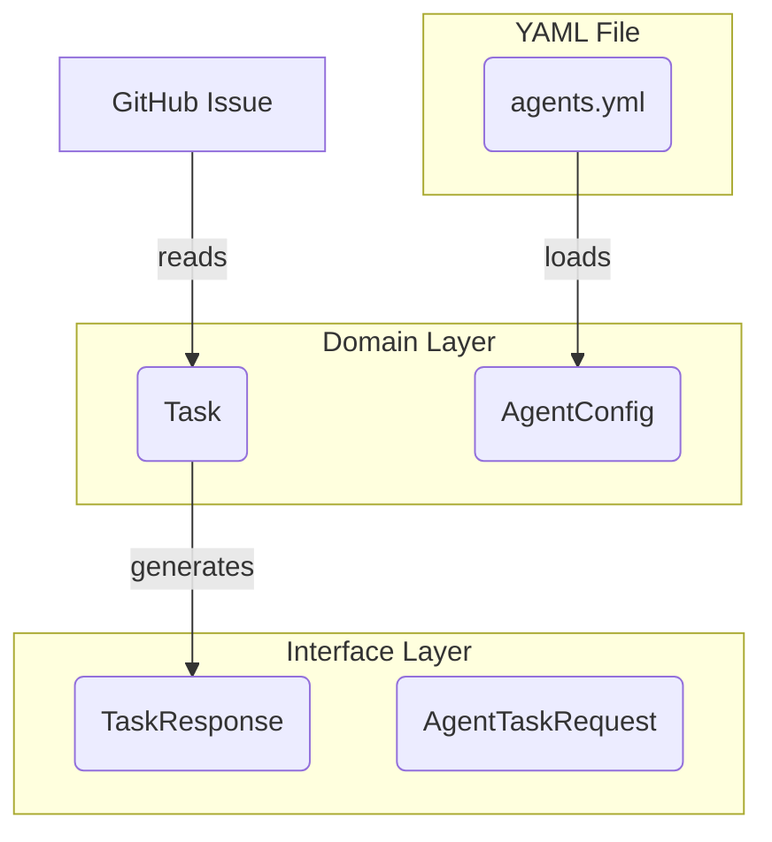

# 【Task】`github_broker`のデータモデル定義書 `data-model.md` を新規作成

## 親Issue (Parent Issue)
- (Story: `github_broker`ドキュメントの整備)

## 子Issue (Sub-Issues)
- (なし)

## 参照元の意思決定 (Source Decision Document)
- (なし)

## As-is (現状)
- `Task`, `TaskResponse`, `AgentConfig`など、アプリケーション内で使用される主要なデータモデル（データ構造）を一覧し、解説するドキュメントが存在しない。
- 各データモデルの定義は、`domain/`や`interface/`配下の複数のPythonファイルに分散しており、全体像を把握しにくい。

## To-be (あるべき姿)
- `docs/architecture/data-model.md`が新規作成される。
- このドキュメントには、`github_broker`で利用される主要なデータモデルのクラス名、目的、主要なプロパティ、および関連するモデルが明確に記述されている。

## ユーザーの意図と背景の明確化
- ユーザーは、アプリケーション内で受け渡されるデータの構造を明確に定義したドキュメントを求めている。これにより、開発者はAPIの仕様やサービスの入出力を正確に理解でき、安全な機能開発が可能になることを意図している。

## **具体的な修正内容**
- **対象ファイル:** `docs/architecture/data-model.md` (新規作成)
- **修正方法:** 以下の内容でファイルを**新規作成**する。

```markdown
# データモデル定義書 (`github_broker`)

このドキュメントは、`github_broker`アプリケーション内で定義・利用される主要なデータモデル（PydanticモデルおよびDataclass）について説明します。

## 1. ドメインモデル

アプリケーションのビジネスロジックの中核をなすデータモデルです。

### `Task`

-   **定義場所:** `github_broker/domain/task.py`
-   **目的:** GitHub Issueの情報をドメインオブジェクトとして表現します。ビジネスロジック（割り当て可能か、など）も持ちます。
-   **主要プロパティ:**
    -   `issue_id`: `int` - Issue番号
    -   `title`: `str` - タイトル
    -   `body`: `str` - 本文
    -   `html_url`: `str` - IssueページのURL
    -   `labels`: `list[str]` - ラベル名のリスト

### `AgentConfig` / `AgentConfigList`

-   **定義場所:** `github_broker/domain/agent_config.py`
-   **目的:** `agents.yml`から読み込まれたエージェントの定義（役割と能力）を表現します。
-   **主要プロパティ (`AgentConfig`):**
    -   `role`: `str` - エージェントの役割名
    -   `description`: `str` - 役割の説明
    -   `capabilities`: `list[str]` - 能力のリスト

## 2. インターフェースモデル (API)

FastAPIのエンドポイントで、リクエストとレスポンスのデータ構造として使用されるモデルです。

-   **定義場所:** `github_broker/interface/models.py`

### `AgentTaskRequest`

-   **目的:** `/request-task`エンドポイントへのリクエストボディ。現在は使用されていませんが、将来的にエージェントの能力を動的に送信するために予約されています。
-   **主要プロパティ:**
    -   `agent_id`: `str`
    -   `capabilities`: `list[str]`

### `TaskResponse`

-   **目的:** `/request-task`エンドポイントの正常なレスポンスボディ。エージェントに割り当てるタスクの詳細情報を含みます。
-   **主要プロパティ:**
    -   `issue_id`, `title`, `body`, `labels`, `branch_name`: `Task`オブジェクトから取得した情報。
    -   `prompt`: `str` - `GeminiExecutor`によって生成された、LLMに渡すためのプロンプト。
    -   `required_role`: `str` - このタスクを実行するために必要な役割。
    -   `task_type`: `TaskType` - `DEVELOPMENT` または `REVIEW` などのタスク種別。

### `TaskCandidate`

-   **目的:** （現在未使用の可能性あり）タスク候補の情報を表現します。
-   **主要プロパティ:**
    -   `issue_id`: `int`
    -   `agent_id`: `str`
    -   `status`: `CandidateStatus` - `PENDING`, `ASSIGNED`, `REJECTED`など。

## 3. モデル間の関係


```

## 完了条件 (Acceptance Criteria)
- `docs/architecture/data-model.md` が、上記の「具体的な修正内容」で新規作成されていること。

## 成果物 (Deliverables)
- 新規作成された `docs/architecture/data-model.md`

## ブランチ戦略 (Branching Strategy)
- **ベースブランチ (Base Branch):** `story/document-github-broker`
- **作業ブランチ (Feature Branch):** `task/create-data-model-doc`
