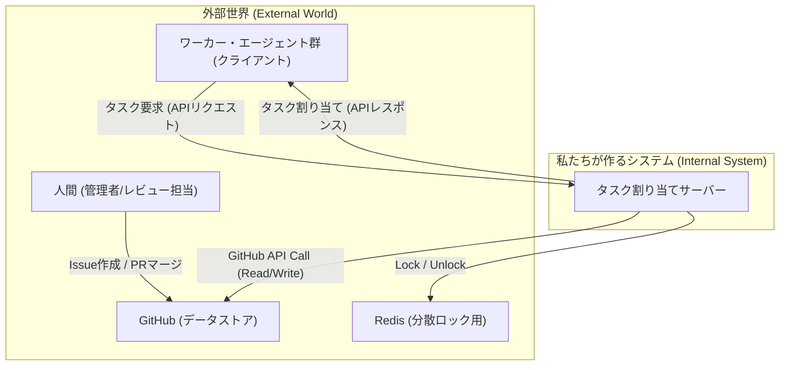

### **設計書：AIエージェント協調システム**

#### 1. 概要
本システムは、複数の自律的なワーカー・エージェントからの要求に応じて、GitHub上のIssueを知的かつ排他的に割り当てる中央集権型サーバーである。システムの目的は、エージェント間の競合を防ぎ、開発ワークフローを自動化・効率化することにある。

#### 2. システム構成図



#### 3. API仕様
ワーカー・エージェントがタスクを要求するための唯一のAPIエンドポイントを定義する。

*   **エンドポイント:** `POST /api/v1/request-task`
*   **説明:** 新しいタスクの割り当てをサーバーに要求する。
*   **リクエストボディ (JSON):**
    ```json
    {
      "agent_id": "string", // ワーカーを一位に識別するID
      "capabilities": ["string"] // ワーカーの能力を示す文字列の配列 (例: ["python", "bugfix", "frontend"])
    }
    ```
*   **レスポンス:**
    *   **成功 (200 OK):** 新しいタスクが割り当てられた場合。
        ```json
        {
          "issue_id": 123,
          "issue_url": "https://github.com/owner/repo/issues/123",
          "title": "Fix login button color",
          "body": "The login button should be blue, not red...",
          "labels": ["bug", "ui"],
          "branch_name": "bugfix/issue-123"
        }
        ```
    *   **成功 (204 No Content):** 割り当てるべき適切なタスクが見つからなかった場合。ボディは空。
    *   **サーバービジー (503 Service Unavailable):** 他のワーカーの処理中でロックが取得できなかった場合。
        ```json
        {
          "error": "Server is busy. Please try again later."
        }
        ```

#### 4. データモデル

*   **割り当て台帳 (State Management):**
    *   サーバーが内部で保持する、ワーカーとIssueの割り当て情報。
    *   **形式:** Key-Valueストア (Redis or インメモリDB)
    *   **Key:** `agent_id` (例: `worker-007`)
    *   **Value:** `issue_id` (例: `123`)

#### 5. コンポーネント別 詳細設計（サーバー内部）

1.  **APIハンドラ (`/api/v1/request-task`):**
    *   リクエストを受け付け、Bodyをパースする。
    *   **分散ロックマネージャー**を呼び出し、ロックの取得を試みる。
    *   ロック取得に失敗した場合、`503`エラーを返す。
    *   ロック取得に成功した場合、以下の処理を順番に呼び出し、最後に必ずロックを解放する。
        1. 前タスクの完了処理
        2. 最適なIssueの選択
        3. **Issue用ブランチの作成**
        4. ワーカーへの応答準備と台帳更新

2.  **分散ロックマネージャー:**
    *   **`acquire_lock()`:** Redisの`SETNX`コマンドを利用して、グローバルロックキーのセットを試みる。ロックには有効期限（例: 30秒）を設定し、サーバークラッシュ時のデッドロックを防ぐ。
    *   **`release_lock()`:** Redisの`DEL`コマンドでロックキーを削除する。

3.  **状態管理 & 前タスク完了処理:**
    *   リクエスト元の`agent_id`をキーに「割り当て台帳」を検索する。
    *   もし、前回の`issue_id`が存在すれば、そのIssueは完了したとみなし、**GitHubクライアント**を介して、該当Issueのラベルを`needs-review`に変更する。

4.  **タスク選択とブランチ作成ロジック:**
    *   **GitHubクライアント**を介して、オープンかつ未割り当てのIssueを全て取得する。
    *   取得したIssueリストとワーカーの`capabilities`を基に、Geminiの能力を使って最適なIssueを1つ選択する。
    *   選択後、そのIssueに対応するブランチを**GitHubクライアント**経由で作成する。命名規則は `(feature|bugfix)/issue-{issue_id}` とする。

5.  **GitHubクライアント:**
    *   GitHub APIとの通信をカプセル化する内部ライブラリ。
    *   `get_open_issues()`
    *   `update_issue(issue_id, ...)`
    *   `create_branch(branch_name, base_branch)` などのメソッドを提供する。

#### 6. シーケンス図（主要フロー）

```mermaid
sequenceDiagram
    participant Worker as ワーカーエージェント
    participant Server as タスク割り当てサーバー
    participant Redis
    participant GitHub

    Worker->>+Server: POST /api/v1/request-task (タスク要求)
    Server->>Redis: SETNX lock (ロック取得試行)

    alt ロック成功
        Redis-->>Server: OK
        Note over Server, GitHub: 前タスクの完了処理
        Server->>GitHub: PATCH /issues/{prev_id} (状態をレビュー待ちに)
        GitHub-->>Server: Response

        Note over Server, GitHub: 新タスクの選択
        Server->>GitHub: GET /issues (オープンなIssue取得)
        GitHub-->>Server: Issue List
        Note right of Server: Geminiの能力で最適なIssueを選択
        
        Note over Server, GitHub: 新タスクの割り当てとブランチ作成
        Server->>GitHub: PATCH /issues/{new_id} (新Issueをワーカーに割り当て)
        GitHub-->>Server: Response
        Server->>GitHub: POST /git/refs (Issue対応ブランチ作成)
        GitHub-->>Server: Response

        Note right of Server: 内部の「割り当て台帳」を更新
        Server-->>-Worker: 200 OK (新タスク情報 + ブランチ名)

    else ロック失敗
        Redis-->>Server: FAILED
        Server-->>-Worker: 503 Service Unavailable (ビジー応答)
    end

    Note left of Redis: 処理完了後、必ずロックを解放
    Server->>Redis: DEL lock (ロック解放)
    Redis-->>Server: OK
```

#### 7. 技術スタック（推奨）
*   **言語:** Python 3.x
*   **Webフレームワーク:** FastAPI (非同期処理に強く、高速) or Flask (シンプル)
*   **分散ロック/状態管理:** Redis
*   **GitHub APIクライアント:** PyGithubライブラリ

#### 8. 実行環境・デプロイ構成（推奨）
本システムは、各コンポーネントをDockerコンテナとして実行する、現代的なコンテナベースのアーキテクチャを推奨します。これにより、開発・テスト・本番環境の一貫性が保たれ、デプロイが容易になります。

複数のコンテナを連携させるためには `docker-compose` を利用するのが標準的です。

**`docker-compose.yml` の設定例:**

```yaml
version: '3.8'

services:
  # 1. タスク割り当てサーバーのコンテナ
  server:
    build: .  # プロジェクトルートにあるDockerfileを使ってビルド
    ports:
      - "8000:8000" # ホストPCの8000番ポートをコンテナの8000番に接続
    environment:
      - REDIS_HOST=redis # 接続先のRedisホスト名を指定
      - GITHUB_TOKEN=${GITHUB_TOKEN} # GitHubのトークンを環境変数で渡す
    depends_on:
      - redis # redisコンテナが起動してからserverを起動する

  # 2. Redisのコンテナ
  redis:
    image: "redis:alpine" # 公式のRedisイメージを利用

  # 3. ワーカーエージェントのコンテナ (例)
  worker-python:
    build: ./workers/python # pythonワーカー用のDockerfileを指定
    environment:
      - SERVER_URL=http://server:8000 # 接続先のサーバーURLを指定
    depends_on:
      - server # serverコンテナが起動してからワーカーを起動する
```

**ポイント:**
*   `docker-compose` は、`server`, `redis`, `worker-python` といった各サービス間の仮想ネットワークを自動で構築します。
*   各コンテナは、他のコンテナにサービス名（例: `server`, `redis`）でアクセスできます。
*   この構成により、各コンポーネントは独立して開発・更新が可能になり、システム全体の保守性とスケーラビリティが向上します。
