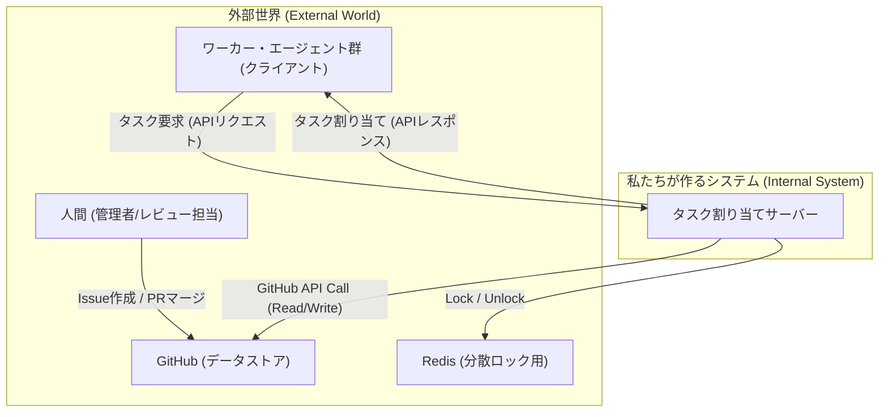

### **設計書：AIエージェント協調システム**

#### 1\. 概要

本システムは、複数の自律的なワーカー・エージェントからの要求に応じて、GitHub上のIssueを知的かつ排他的に割り当てる中央集権型サーバーである。システムの目的は、エージェント間の競合を防ぎ、開発ワークフローを自動化・効率化することにある。

-----

#### 2\. システム構成図



-----

#### 3\. API仕様

ワーカー・エージェントがタスクを要求するための唯一のAPIエンドポイントを定義する。

  * **エンドポイント:** `POST /api/v1/request-task`
  * **説明:** 新しいタスクの割り当てをサーバーに要求する。
  * **リクエストボディ (JSON):**
    ```json
    {
      "agent_id": "string", // ワーカーを一位に識別するID
      "capabilities": ["string"] // ワーカーの能力を示す文字列の配列 (例: ["python", "bugfix", "frontend"])
    }
    ```
  * **レスポンス:**
      * **成功 (200 OK):** 新しいタスクが割り当てられた場合。
        ```json
        {
          "issue_id": 123,
          "issue_url": "https://github.com/owner/repo/issues/123",
          "title": "Fix login button color",
          "body": "The login button should be blue, not red...",
          "labels": ["bug", "ui"],
          "branch_name": "bugfix/issue-123"
        }
        ```
      * **成功 (204 No Content):** 割り当てるべき適切なタスクが見つからなかった場合。ボディは空。
      * **サーバービジー (503 Service Unavailable):** 他のワーカーの処理中でロックが取得できなかった場合。
        ```json
        {
          "error": "Server is busy. Please try again later."
        }
        ```

-----

#### 4\. データモデル

  * **割り当て台帳 (State Management):**
      * サーバーはワーカーとIssueの割り当て状態を**GitHub Issueのラベル**を利用して管理する。これにより、状態管理をGitHubに一元化する。
      * **`in-progress` ラベル:** タスクが進行中であることを示す**状態ラベル**。
      * **`[agent_id]` ラベル:** タスクの**担当エージェント**を示すラベル (例: `gemini-agent`)。
      * **`needs-review` ラベル:** タスクが完了し、人間によるレビュー待ちであることを示す状態ラベル。

-----

#### 5\. コンポーネント別 詳細設計（サーバー内部）

1.  **APIハンドラ (`/api/v1/request-task`):**

      * リクエストを受け付け、Bodyをパースする。
      * **分散ロックマネージャー**を呼び出し、ロックの取得を試みる。
      * ロック取得に失敗した場合、`503`エラーを返す。
      * ロック取得に成功した場合、以下の処理を順番に呼び出し、最後に必ずロックを解放する。
        1.  前タスクの完了処理
        2.  最適なIssueの選択
        3.  **Issue用ブランチの作成**
        4.  ワーカーへの応答準備と台帳更新

2.  **分散ロックマネージャー:**

      * **`acquire_lock()`:** Redisの`SETNX`コマンドを利用して、グローバルロックキーのセットを試みる。ロックには有効期限（例: 30秒）を設定し、サーバークラッシュ時のデッドロックを防ぐ。
      * **`release_lock()`:** Redisの`DEL`コマンドでロックキーを削除する。

3.  **状態管理 & 前タスク完了処理:**

      * リクエスト元の`agent_id`をキーに、**`in-progress`と`[agent_id]`の両方のラベルを持つIssue**をGitHubから検索する。
      * もし、前回のIssueが存在すれば、そのIssueは完了したとみなし、**GitHubクライアント**を介して、該当Issueから`in-progress`と`[agent_id]`のラベルを削除し、代わりに`needs-review`ラベルを付与する。
      * **GitHubの検索インデックス遅延を考慮し、ラベルを更新した場合は後続処理の前に一定時間（例: 15秒）待機する。**

4.  **タスク選択とブランチ作成ロジック:**

    1.  **Issueの取得:** GitHubクライアントを介して、リポジトリのオープンなIssueを全て取得する。
    2.  **候補のフィルタリング:** 取得したIssueと、ワーカーから受け取った`capabilities`を比較し、Issueが持つラベルの**うち1つでも**`capabilities`に含まれているものをタスク候補とする。
    3.  **優先順位付け:** タスク候補を、`capabilities`とラベルの**一致数が最も多い順**にソートする。これにより、ワーカーの能力に最も合致するタスクが優先される。
    4.  **前提条件チェック:** 優先順位の高い順に各候補Issueの本文をチェックし、「成果物」セクションが正しく定義されている最初のIssueを選択する。
    5.  **ブランチ作成：**
          * 選択したIssueに対応するブランチを**GitHubクライアント**経由で作成する。
          * **Issue本文にブランチ名の指定がない場合は、`feature/issue-{issue_id}`という形式でデフォルト名を生成する。**
    6.  **タスク割り当て:** 選択したIssueに`in-progress`と`[agent_id]`のラベルを付与する。
    7.  **候補なし:** 全ての候補が前提条件チェックをパスしなかった場合、割り当てるタスクはないものとする。

5.  **GitHubクライアント:**

      * GitHub APIとの通信をカプセル化する内部ライブラリ。
      * `get_open_issues()`: リポジトリに存在する**全てのオープンなIssueを取得**する。具体的なフィルタリングはアプリケーション層の責務とする。
      * **`find_issues_by_labels()`: GitHub検索APIの不安定性を回避するため、リポジトリの全Issueを取得してからアプリケーション側でラベルによるフィルタリングを行うロジックを持つ。**
      * **スケーラビリティに関する注意点:** この全件取得アプローチは、リポジトリのIssueが数万件規模に増加した場合、パフォーマンスの低下やAPIレート制限のリスクを伴います。将来的な対策として、ETagを利用したキャッシュ戦略や、定期的な全件取得とWebhookによる差分更新を組み合わせるなどの検討が必要です。
      * `update_issue(issue_id, ...)`
      * `create_branch(branch_name, base_branch)` などのメソッドを提供する。

-----

#### 6\. シーケンス図（主要フロー）

```mermaid
sequenceDiagram
    participant Worker as ワーカーエージェント
    participant Server as タスク割り当てサーバー
    participant Redis
    participant GitHub

    Worker->>+Server: POST /api/v1/request-task (タスク要求)
    Server->>Redis: SETNX lock (ロック取得試行)

    alt ロック成功
        Redis-->>Server: OK
        Note over Server, GitHub: 前タスクの完了処理 (in-progress, agent_id ラベルを検索)
        Server->>GitHub: GET /issues (ラベル検索)
        alt 前タスクあり
            GitHub-->>Server: Previous Issue
            Server->>GitHub: PATCH /issues/{prev_id} (ラベルを needs-review に変更)
            GitHub-->>Server: Response
            Server->>Server: **Wait 15s (インデックス更新待ち)**
        end

        Note over Server, GitHub: 新タスクの選択
        Server->>GitHub: GET /issues (全てのオープンなIssue取得)
        GitHub-->>Server: Issue List
        Server->>Server: 1. Filter by Capabilities (1つでも一致)
        Server->>Server: 2. Sort by match count (一致数で降順ソート)
        Server->>Server: 3. Check for "成果物" section
        
        alt 最適なIssueあり
            Note over Server, GitHub: 新タスクの割り当てとブランチ作成
            Server->>GitHub: POST /git/refs (Issue対応ブランチ作成)
            GitHub-->>Server: Response
            Server->>GitHub: PATCH /issues/{new_id} (in-progress, agent_id ラベル付与)
            GitHub-->>Server: Response
            Server-->>-Worker: 200 OK (新タスク情報)
        else 最適なIssueなし
            Server-->>-Worker: 204 No Content
        end
        
    else ロック失敗
        Redis-->>Server: FAILED
        Server-->>-Worker: 503 Service Unavailable
    end

    Server->>Redis: DEL lock (ロック解放)
    Redis-->>Server: OK
```

-----

#### 7\. 堅牢性のための設計

  * **GitHub APIの特性への対応:**
      * **ブランチが既に存在する場合 (`422 Reference already exists`) はエラーとせず、処理を続行する。**
      * **Issueのラベル更新直後の検索反映遅延を考慮し、明示的な待機時間を設ける。**

-----

#### 8\. 技術スタック（推奨）

  * **言語:** Python 3.x
  * **Webフレームワーク:** FastAPI (非同期処理に強く、高速) or Flask (シンプル)
  * **分散ロック/状態管理:** Redis
  * **GitHub APIクライアント:** PyGithubライブラリ
  * **DIコンテナ:** punq

-----

#### 9\. 実行環境・デプロイ構成（推奨）

本システムは、各コンポーネントをDockerコンテナとして実行する、現代的なコンテナベースのアーキテクチャを推奨します。これにより、開発・テスト・本番環境の一貫性が保たれ、デプロイが容易になります。

複数のコンテナを連携させるためには `docker-compose` を利用するのが標準的です。

**`docker-compose.yml` の設定例:**

```yaml
version: '3.8'

services:
  # 1. タスク割り当てサーバーのコンテナ
  server:
    build: .  # プロジェクトルートにあるDockerfileを使ってビルド
    ports:
      - "8000:8000" # ホストPCの8000番ポートをコンテナの8000番に接続
    environment:
      - REDIS_HOST=redis # 接続先のRedisホスト名を指定
      - GITHUB_TOKEN=${GITHUB_TOKEN} # GitHubのトークンを環境変数で渡す
    depends_on:
      - redis # redisコンテナが起動してからserverを起動する

  # 2. Redisのコンテナ
  redis:
    image: "redis:alpine" # 公式のRedisイメージを利用

  # 3. ワーカーエージェントのコンテナ (例)
  worker-python:
    build: ./workers/python # pythonワーカー用のDockerfileを指定
    environment:
      - SERVER_URL=http://server:8000 # 接続先のサーバーURLを指定
    depends_on:
      - server # serverコンテナが起動してからワーカーを起動する
```

**ポイント:**

  * `docker-compose` は、`server`, `redis`, `worker-python` といった各サービス間の仮想ネットワークを自動で構築します。
  * 各コンテナは、他のコンテナにサービス名（例: `server`, `redis`）でアクセスできます。
  * この構成により、各コンポーネントは独立して開発・更新が可能になり、システム全体の保守性とスケーラビリティが向上します。

-----

#### 10\. 依存性注入 (Dependency Injection)

本プロジェクトでは、コンポーネント間の依存関係を管理し、テスト容易性を向上させるために、依存性注入（DI）の原則を採用しています。

  * **採用ライブラリ:** 軽量なDIコンテナである `punq` を利用します。

  * **設定:** 依存関係の定義は `github_broker/infrastructure/di_container.py` に一元管理されます。各コンポーネント（`TaskService`, `GitHubClient`等）は、アプリケーション起動時にDIコンテナに`singleton`として登録されます。

    ```python
    # github_broker/infrastructure/di_container.py (抜粋)
    import punq
    # ...
    container = punq.Container()
    # ...
    container.register(GitHubClient, scope=punq.Scope.singleton)
    container.register(TaskService, scope=punq.Scope.singleton)
    ```

  * **利用方法:** API層では、FastAPIのDIシステムと連携してコンテナを利用します。`Depends` を使うことで、エンドポイントが必要とするサービス（例: `TaskService`）をコンテナから自動的に受け取ることができます。

    ```python
    # github_broker/interface/api.py (抜粋)
    from fastapi import Depends
    from github_broker.infrastructure.di_container import container
    # ...
    def get_task_service() -> TaskService:
        return container.resolve(TaskService)

    @app.post("/request-task")
    async def request_task_endpoint(
        task_service: TaskService = Depends(get_task_service),
    ):
        # ...
    ```

この設計により、各コンポーネントは自身が必要とする依存関係を意識することなく、その生成をDIコンテナに一任できます。結果として、コードの結合度が下がり、単体テストにおけるモックの差し替えなどが容易になります。

-----

#### 11\. 環境変数

本システムは、以下の環境変数を通じて設定を外部から注入します。

| 環境変数名          | 説明                                           | デフォルト値 |
| ------------------- | ---------------------------------------------- | ------------ |
| `BROKER_PORT`       | サーバーがリッスンするポート番号。             | `8080`       |
| `GITHUB_TOKEN`      | GitHub API認証用のパーソナルアクセストークン。 | `None`       |
| `GITHUB_REPOSITORY` | 操作対象のリポジトリ (例: `owner/repo`)。      | `None`       |
| `REDIS_HOST`        | Redisサーバーのホスト名。                      | `localhost`  |
| `REDIS_PORT`        | Redisサーバーのポート番号。                    | `6379`       |
| `REDIS_DB`          | Redisのデータベース番号。                        | `0`          |