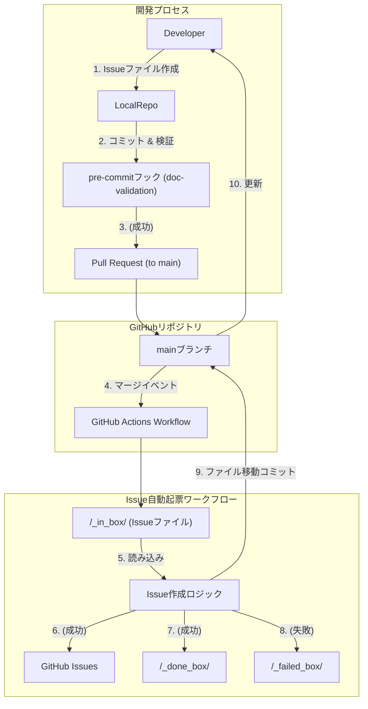

# Issue自動起票ワークフロー概要

## 目的

本ドキュメントは、[ADR-017: _in_box方式によるIssue自動起票ワークフローの導入](../adr/017-commit-triggered-issue-creation.md)で決定された、コミットトリガーによるIssue自動起票ワークフローの全体像を記述します。これにより、開発チームがこのワークフローを理解し、利用・運用するために必要な情報を提供することを目的とします。

## 背景

従来のIssue作成プロセスは、GitHubのWeb UIやテンプレートに依存していました。しかし、開発プロセスをより効率化し、コミット内容に基づいてIssueを自動的に生成するニーズが高まりました。本ワークフローは、特定のGitリポジトリ（`/_in_box`フォルダ）にIssueファイルを配置することで、GitHub Actionsを通じてIssueを自動的に起票する「GitOps」的なアプローチを採用しています。

## 全体構成と主要コンポーネント

Issue自動起票ワークフローは、以下の主要なコンポーネントで構成されます。

-   **`/_in_box/` フォルダ**: Issueファイルの入力キューとして機能します。開発者はここにMarkdown形式で記述されたIssueファイルを配置します。
-   **`main` ブランチ**: GitHubリポジトリのメインブランチです。Pull Requestのマージがワークフローの主要なトリガーとなります。
-   **`pre-commit` フック**: Issueファイルが`/_in_box/`フォルダにコミットされる前に、そのフォーマットと内容の妥当性を検証します。
-   **GitHub Actions Workflow**: Pull Requestが`main`ブランチにマージされたことをトリガーに実行され、`/_in_box/`フォルダ内のIssueファイルを処理し、GitHub Issueの自動起票、およびファイルの移動（`/_done_box/`または`/_failed_box/`）を行います。
-   **`/_done_box/` フォルダ**: Issueの起票が成功したIssueファイルが移動される場所です。
-   **`/_failed_box/` フォルダ**: Issueの起票に失敗したIssueファイルが移動される場所です。

### コンポーネント図

## ワークフローの動作シーケンス

1.  **Issueファイルの作成と準備**:
    *   開発者は、Markdown形式で記述されたIssueファイルを`/_in_box/`フォルダ内に作成します。このファイルには、Issueのタイトル、本文、ラベル、担当者などの情報が含まれます。
2.  **コミットと事前検証**:
    *   `git commit` 時に `pre-commit` フックが実行され、`/_in_box/`フォルダ内のIssueファイルのフォーマットと内容の妥当性が自動的に検証されます。これにより、品質の高いIssueファイルのみがリポジトリにコミットされることが保証されます。
3.  **Pull Requestの作成とマージ**:
    *   検証を通過したIssueファイルを含む変更がPull Requestとして作成され、`main`ブランチにマージされます。
4.  **GitHub Actions Workflowのトリガー**:
    *   Pull Requestが`main`ブランチにマージされると、GitHub Actions Workflowが自動的にトリガーされます。
5.  **Issueファイルの処理**:
    *   ワークフローは`/_in_box/`フォルダ内のIssueファイルを読み込み、その内容に基づいてGitHub Issueを作成します。
6.  **結果に応じたファイル移動と自動コミット**:
    *   Issueの作成が成功した場合、元のIssueファイルは`/_in_box/`から`/_done_box/`に移動されます。
    *   Issueの作成に失敗した場合、元のIssueファイルは`/_in_box/`から`/_failed_box/`に移動されます。
    *   これらのファイル移動は、新しいコミットとして`main`ブランチに自動的にプッシュされます。この自動コミットは、ワークフローの無限ループを回避するように設計されています。

## メリットとトレードオフ

### メリット

-   **汎用性と再利用性**: プロジェクト固有のツールに依存せず、GitHubのネイティブ機能で実装されるため、他のGitHubリポジトリにも容易に適用可能です。
-   **堅牢な開発プロセス**: `pre-commit`フックによる事前検証と、成功/失敗時のファイル移動メカニズムにより、品質と追跡可能性が向上します。
-   **無限ループのリスク解消**: Pull Requestマージをトリガーとすることで、自動コミットがワークフローを再トリガーする無限ループの問題を安全に回避できます。

### トレードオフ

-   **ロジックの管理**: Issue本文の生成やファイル移動ロジックはGitHub ActionsのYAMLまたはスクリプト内に記述されるため、複雑なロジックは適切な設計とコメントが必要となります。

## 関連ドキュメント

*   [ADR-017: _in_box方式によるIssue自動起票ワークフローの導入](../adr/017-commit-triggered-issue-creation.md)
