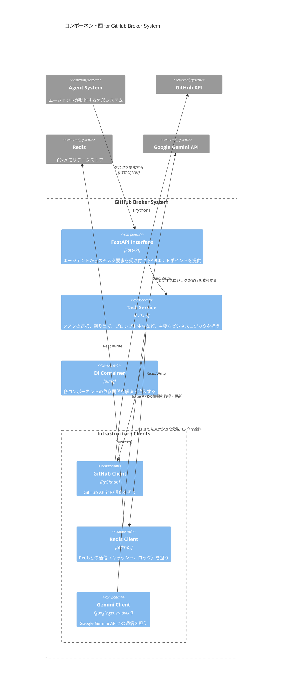

# C4モデル: コンポーネント図 (`github_broker`)

## 概要

これは、`github-broker`システムの内部アーキテクチャを、C4モデルのレベル2（コンポーネント図）で示したものです。
`github-broker`コンテナが、どのようなコンポーネントで構成されているかを示します。

## 図

## コンポーネント

### `FastAPI Interface`

-   **責務:** 外部からのHTTPリクエストを受け付けるインターフェース層。
-   **詳細:** `/request-task` などのエンドポイントを公開し、リクエストの検証を行った後、`Task Service`に処理を委譲します。

### `Task Service`

-   **責務:** アプリケーションのコアとなるビジネスロジック（ユースケース）を実行します。
-   **詳細:** タスクの選択（優先度判定、遅延処理）、ロック取得、プロンプト生成、状態更新など、タスク割り当てに関する一連の複雑なフローを管理します。

### `DI Container`

-   **責務:** `punq`ライブラリを使用し、各コンポーネントの依存関係を解決し、注入します。
-   **詳細:** アプリケーション起動時に、`GitHub Client`や`Redis Client`などのインスタンスを生成し、`Task Service`などに渡します。詳細は `di-container.md` を参照。

### `Infrastructure Clients`

-   **`GitHub Client`:** `PyGithub`ライブラリのラッパー。GitHub APIとの通信に責任を持ちます。
-   **`Redis Client`:** `redis-py`ライブラリのラッパー。Redisへのデータキャッシュや分散ロックの取得・解放に責任を持ちます。
-   **`Gemini Client`:** Google Gemini APIとの通信に責任を持ちます。
