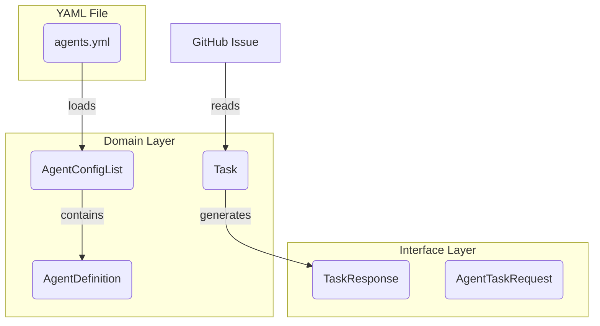

# データモデル定義書 (`github_broker`)

このドキュメントは、`github_broker`アプリケーション内で定義・利用される主要なデータモデル（PydanticモデルおよびDataclass）について説明します。

## 1. ドメインモデル

アプリケーションのビジネスロジックの中核をなすデータモデルです。

### `Task`

-   **定義場所:** `github_broker/domain/task.py`
-   **目的:** GitHub Issueの情報をドメインオブジェクトとして表現します。ビジネスロジック（割り当て可能か、など）も持ちます。
-   **主要プロパティ:**
    -   `issue_id`: `int` - Issue番号
    -   `title`: `str` - タイトル
    -   `body`: `str` - 本文
    -   `html_url`: `str` - IssueページのURL
    -   `labels`: `list[str]` - ラベル名のリスト

### `AgentDefinition` / `AgentConfigList`

-   **定義場所:** `github_broker/domain/agent_config.py`
-   **目的:** `agents.yml`から読み込まれたエージェントの定義（役割と能力）を表現します。
-   **主要プロパティ (`AgentDefinition`):**
    -   `role`: `str` - エージェントの役割名。`Field(..., description="The role of the agent.")`
    -   `persona`: `str` - エージェントのペルソナ（振る舞い）。`Field(..., description="The persona of the agent.")`
-   **主要プロパティ (`AgentConfigList`):**
    -   `agents`: `list[AgentDefinition]` - エージェント定義のリスト

## 2. インターフェースモデル (API)

FastAPIのエンドポイントで、リクエストとレスポンスのデータ構造として使用されるモデルです。

-   **定義場所:** `github_broker/interface/models.py`

### `AgentTaskRequest`

-   **目的:** エージェントからのタスク要求リクエストボディ。
-   **主要プロパティ:**
    -   `agent_id`: `str`

### `TaskResponse`

-   **目的:** `/request-task`エンドポイントの正常なレスポンスボディ。エージェントに割り当てるタスクの詳細情報を含みます。
-   **主要プロパティ:**
    -   `issue_id`: `int`
    -   `issue_url`: `HttpUrl`
    -   `title`: `str`
    -   `body`: `str`
    -   `labels`: `list[str]`
    -   `branch_name`: `str`
    -   `prompt`: `str` - LLMに渡すためのプロンプト。
    -   `required_role`: `str` - このタスクを実行するために必要な役割。
    -   `task_type`: `TaskType` - `DEVELOPMENT`, `REVIEW`, `FIX` などのタスク種別。
    -   `gemini_response`: `str | None`

### `TaskCandidate`

-   **目的:** タスク候補の情報を表現します。
-   **主要プロパティ:**
    -   `issue_id`: `int`
    -   `agent_id`: `str`
    -   `status`: `TaskCandidateStatus` - `PENDING`, `ASSIGNED` など。

### `CreateFixTaskRequest`

-   **目的:** 修正タスク作成リクエスト。
-   **主要プロパティ:**
    -   `pull_request_number`: `int`
    -   `review_comments`: `list[str]`

## 3. モデル間の関係

