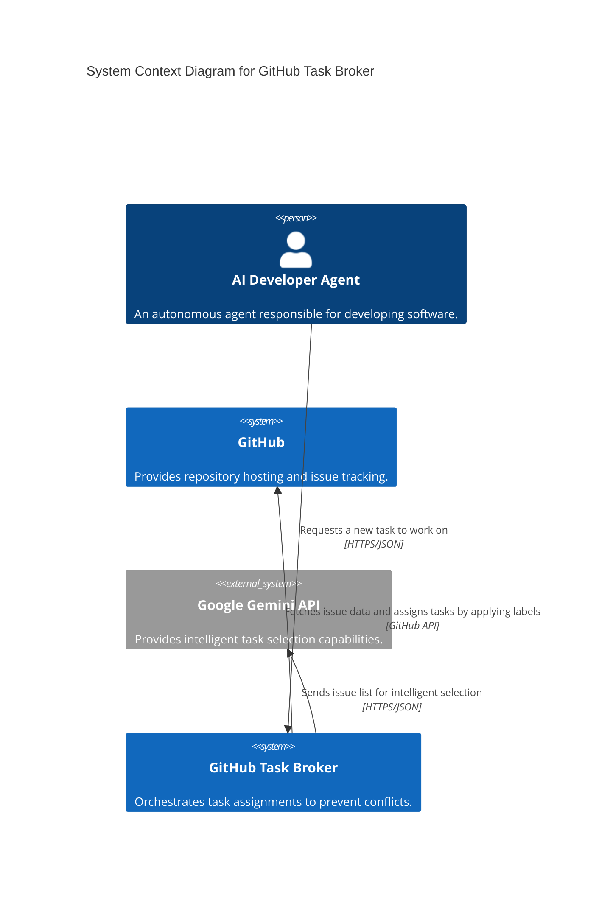
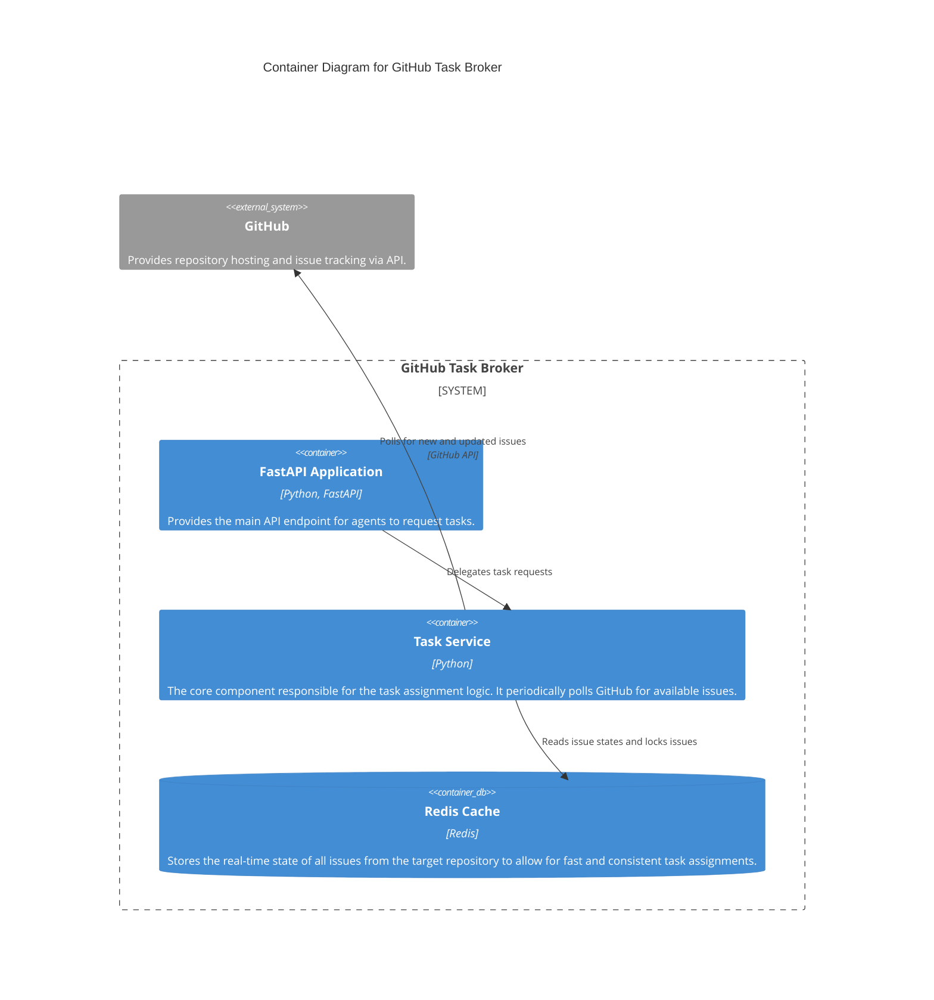

# Architecture Overview

This document provides a high-level overview of the GitHub Task Broker system architecture, following the C4 model for visualizing software architecture.

## System Context Diagram

The following diagram shows the system context, illustrating how the GitHub Task Broker fits into its operating environment.

## Container Diagram

The following diagram zooms into the GitHub Task Broker system, showing its main logical containers.

## Architectural Drivers

- **Decoupling:** The primary goal is to decouple the AI Developer Agents from each other, preventing them from working on the same issue simultaneously.
- **Simplicity:** The architecture was shifted from webhook-based to a polling-based model to simplify local development and remove the need for a publicly exposed endpoint.
- **Scalability:** While the current polling model is simple, the system is designed with a separate `TaskService` that could be scaled independently or have its polling logic improved in the future (e.g., using conditional requests with ETags).
