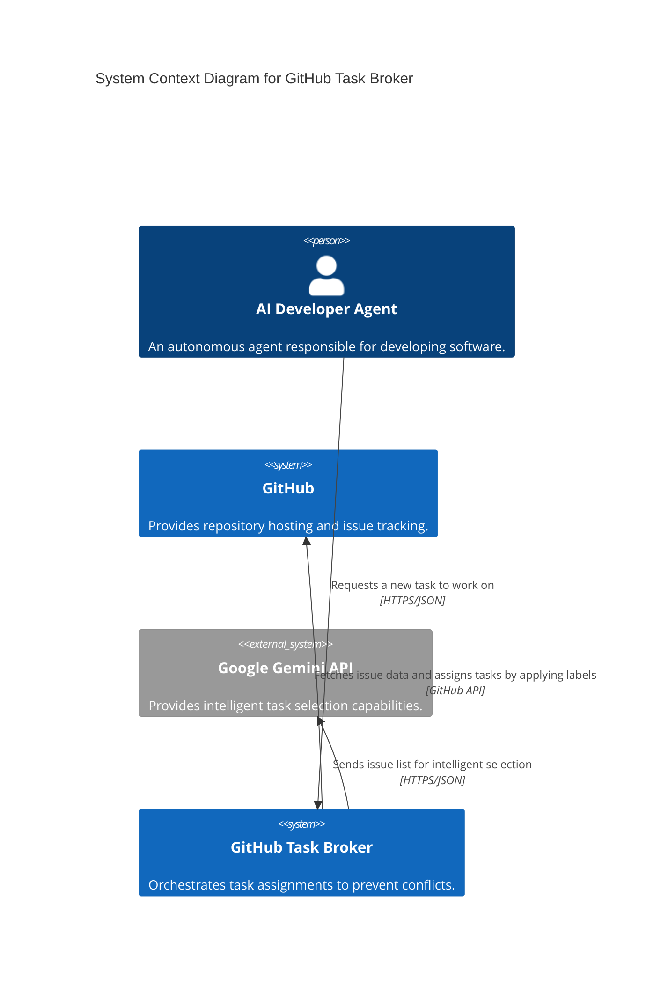
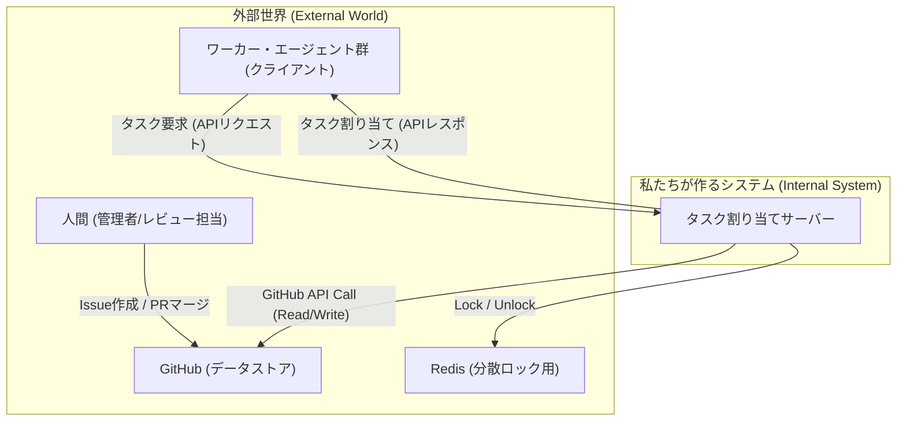

# Architecture Overview

#### 1. 概要

本ドキュメントは、GitHub Task Brokerシステムのアーキテクチャ全体像を、C4モデルを用いて視覚的に表現します。

-----

#### 2. アーキテクチャ設計

本プロジェクトは、クリーンアーキテクチャの原則に基づき、関心事の分離を徹底しています。これにより、システムの各コンポーネントが単一の責任を持ち、変更の影響範囲を限定し、独立した開発とテストを可能にしています。

##### 2.1. レイヤーとディレクトリ構成のマッピング

| レイヤー | 責務 | 対応ディレクトリ |
| :--- | :--- | :--- |
| **Domain** | アプリケーションに依存しない、中核となるビジネスロジックとエンティティを定義します。 | `github_broker/domain/` |
| **Application** | ユースケースを実現するための、アプリケーション固有のビジネスロジックを実装します。 | `github_broker/application/` |
| **Interface** | 外部との境界を担当します。APIの定義や、リクエスト・レスポンスのデータモデルを定義します。 | `github_broker/interface/` |
| **Infrastructure** | フレームワーク、データベース、外部APIクライアントなど、具体的な実装技術を担当します。 | `github_broker/infrastructure/` |

##### 2.2. 詳細設計ドキュメント

より詳細なアーキテクチャ上の決定については、以下のドキュメントを参照してください。

- [依存性注入(DI)コンテナ 設計書](./di-container.md)
- [Redisキースキーマ 設計書](./redis-schema.md)

-----

#### 3. システム構成図



-----

#### 4. API仕様

ワーカー・エージェントがタスクを要求するための唯一のAPIエンドポイントを定義する。

  * **エンドポイント:** `POST /api/v1/request-task`
  * **説明:** 新しいタスクの割り当てをサーバーに要求する。
  * **リクエストボディ (JSON):**
    ```json
    {
      "agent_id": "string", // ワーカーを一意に識別するID
      "agent_role": "string" // ワーカーの役割を示す文字列 (例: "CODER")
    }
    ```
  * **レスポンス:**
      * **成功 (200 OK):** 新しいタスクが割り当てられた場合。
        ```json
        {
          "issue_id": 123,
          "issue_url": "https://github.com/owner/repo/issues/123",
          "title": "Fix login button color",
          "body": "The login button should be blue, not red...",
          "labels": ["bug", "ui"],
          "branch_name": "bugfix/issue-123"
        }
        ```
      * **成功 (204 No Content):** 割り当てるべき適切なタスクが見つからなかった場合。ボディは空。
      * **サーバービジー (503 Service Unavailable):** 他のワーカーの処理中でロックが取得できなかった場合。
        ```json
        {
          "error": "Server is busy. Please try again later."
        }
        ```

-----

#### 5. データモデル

  * **割り当て台帳 (State Management):**
      * サーバーはワーカーとIssueの割り当て状態を**GitHub Issueのラベル**を利用して管理する。これにより、状態管理をGitHubに一元化する。
      * **`in-progress` ラベル:** タスクが進行中であることを示す**状態ラベル**。
      * **`[agent_id]` ラベル:** タスクの**担当エージェント**を示すラベル (例: `gemini-agent`)。
      * **`needs-review` ラベル:** タスクが完了し、人間によるレビュー待ちであることを示す状態ラベル。

-----

#### 6. コンポーネント別 詳細設計（サーバー内部）

1.  **APIハンドラ (`/api/v1/request-task`):**

      * リクエストを受け付け、Bodyをパースする。
      * **分散ロックマネージャー**を呼び出し、ロックの取得を試みる。
      * ロック取得に失敗した場合、`503`エラーを返す。
      * ロック取得に成功した場合、以下の処理を順番に呼び出し、最後に必ずロックを解放する。
        1.  前タスクの完了処理
        2.  最適なIssueの選択
        3.  **Issue用ブランチの作成**
        4.  ワーカーへの応答準備と台帳更新

2.  **分散ロックマネージャー:**

      * **`acquire_lock()`:** Redisの`SETNX`コマンドを利用して、グローバルロックキーのセットを試みる。ロックには有効期限（例: 30秒）を設定し、サーバークラッシュ時のデッドロックを防ぐ。
      * **`release_lock()`:** Redisの`DEL`コマンドでロックキーを削除する。

3.  **状態管理 & 前タスク完了処理:**

      * リクエスト元の`agent_id`をキーに、**`in-progress`と`[agent_id]`の両方のラベルを持つIssue**をGitHubから検索する。
      * もし、前回のIssueが存在すれば、そのIssueは完了したとみなし、**GitHubクライアント**を介して、該当Issueから`in-progress`と`[agent_id]`のラベルを削除し、代わりに`needs-review`ラベルを付与する。
      * **GitHubの検索インデックス遅延を考慮し、ラベルを更新した場合は後続処理の前に一定時間（例: 15秒）待機する。**

4.  **タスク選択とブランチ作成ロジック:**

    1.  **Issueの取得:** GitHubクライアントを介して、リポジトリのオープンなIssueを全て取得する。
    2.  **候補のフィルタリング:** 取得したIssueの中から、リクエストの`agent_role`と一致するラベルを持つIssueをタスク候補として抽出する。
    3.  **優先順位付け:** 役割に一致するタスクが複数ある場合、最も古く作成されたIssueを優先する。
    4.  **前提条件チェック:** 優先順位の高い順に各候補Issueの本文をチェックし、「成果物」セクションが正しく定義されている最初のIssueを選択する。
    5.  **ブランチ作成：**
          * 選択したIssueに対応するブランチを**GitHubクライアント**経由で作成する。
          * **Issue本文にブランチ名の指定がない場合は、`feature/issue-{issue_id}`という形式でデフォルト名を生成する。**
    6.  **タスク割り当て:** 選択したIssueに`in-progress`と`[agent_id]`のラベルを付与する。
    7.  **候補なし:** 全ての候補が前提条件チェックをパスしなかった場合、割り当てるタスクはないものとする。

5.  **GitHubクライアント:**

-----

#### 7. シーケンス図（主要フロー）



-----

#### 8. 堅牢性のための設計

  * **GitHub APIの特性への対応:**
      * **ブランチが既に存在する場合 (`422 Reference already exists`) はエラーとせず、処理を続行する。**
      * **Issueのラベル更新直後の検索反映遅延を考慮し、明示的な待機時間を設ける。**

-----

#### 9. 技術スタック（推奨）

  * **言語:** Python 3.x
  * **Webフレームワーク:** FastAPI (非同期処理に強く、高速) or Flask (シンプル)
  * **分散ロック/状態管理:** Redis
  * **GitHub APIクライアント:** PyGithubライブラリ
  * **DIコンテナ:** punq

-----

#### 10. 実行環境・デプロイ構成（推奨）

本システムは、各コンポーネントをDockerコンテナとして実行する、現代的なコンテナベースのアーキテクチャを推奨します。これにより、開発・テスト・本番環境の一貫性が保たれ、デプロイが容易になります。

複数のコンテナを連携させるためには `docker-compose` を利用するのが標準的です。

**`docker-compose.yml` の設定例:**

```yaml
version: '3.8'

services:
  server:
    build:
      context: .
      dockerfile: .build/Dockerfile
    ports:
      - "8080:8080"
    environment:
      GITHUB_TOKEN: ${GITHUB_TOKEN}
      GITHUB_REPOSITORY: ${GITHUB_REPOSITORY}
      GEMINI_API_KEY: ${GEMINI_API_KEY}
      APP_PORT: 8080
    depends_on:
      - redis

  redis:
    image: "redis:7-alpine"
    ports:
      - "6379:6379"

  worker-python:
    build:
      context: .
      dockerfile: .build/Dockerfile
    environment:
      AGENT_ID: worker-python-1
      AGENT_ROLE: CODER
      SERVER_HOST: server
      SERVER_PORT: 8080
    depends_on:
      - server
```

-----

#### 11. 依存性注入 (Dependency Injection)

本プロジェクトでは、コンポーネント間の依存関係を管理し、テスト容易性を向上させるために、依存性注入（DI）の原則を採用しています。

  * **採用ライブラリ:** 軽量なDIコンテナである `punq` を利用します。

  * **設定:** 依存関係の定義は `github_broker/infrastructure/di_container.py` に一元管理されます。各コンポーネント（`TaskService`, `GitHubClient`等）は、アプリケーション起動時にDIコンテナに`singleton`として登録されます。

    ```python
    # github_broker/infrastructure/di_container.py (抜粋)
    import punq
    # ...
    container = punq.Container()
    # ...
    container.register(GitHubClient, scope=punq.Scope.singleton)
    container.register(TaskService, scope=punq.Scope.singleton)
    ```

  * **利用方法:** API層では、FastAPIのDIシステムと連携してコンテナを利用します。`Depends` を使うことで、エンドポイントが必要とするサービス（例: `TaskService`）をコンテナから自動的に受け取ることができます。

    ```python
    # github_broker/interface/api.py (抜粋)
    from fastapi import Depends
    from github_broker.infrastructure.di_container import container
    # ...
    def get_task_service() -> TaskService:
        return container.resolve(TaskService)

    @app.post("/request-task")
    async def request_task_endpoint(
        task_service: TaskService = Depends(get_task_service),
    ):
        # ...
    ```

この設計により、各コンポーネントは自身が必要とする依存関係を意識することなく、その生成をDIコンテナに一任できます。結果として、コードの結合度が下がり、単体テストにおけるモックの差し替えなどが容易になります。

-----

#### 12. 環境変数

本システムの動作に必要な環境変数については、以下のドキュメントを参照してください。

- [運用・デプロイ要件定義書 > 8. 環境変数](./operational-requirements.md#8-環境変数)