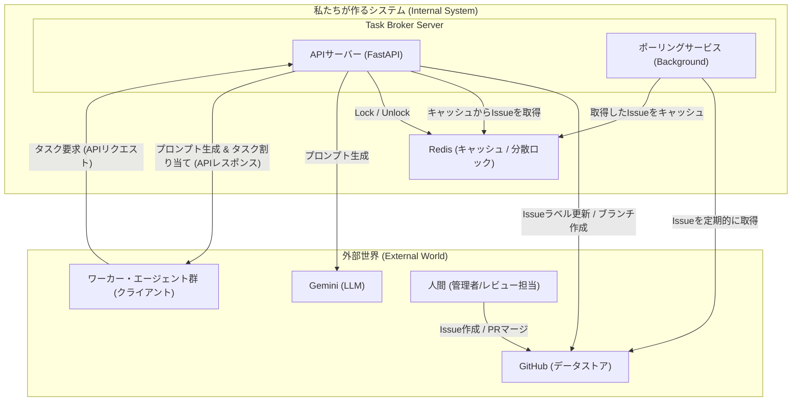
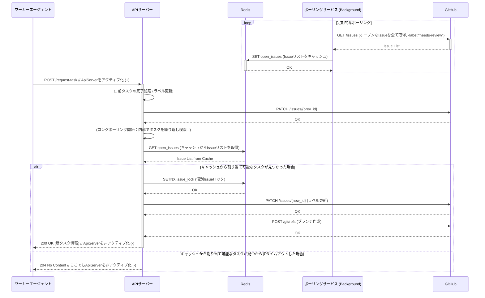

### 設計書：AIエージェント協調システム

#### 1. 概要

本システムは、バックグラウンドでGitHubを定期的にポーリングする「ポーリングサービス」と、ワーカー・エージェントからのタスク要求を処理する「APIサーバー」の2つの主要コンポーネントで構成されるハイブリッドモデルで動作する。システムの目的は、エージェント間の競合を防ぎ、開発ワークフローを自動化・効率化することにある。

----

#### 2. アーキテクチャ設計

本プロジェクトは、クリーンアーキテクチャの原則に基づき、関心事の分離を徹底しています。これにより、システムの各コンポーネントが単一の責任を持ち、変更の影響範囲を限定し、独立した開発とテストを可能にしています。

##### 2.1. レイヤーとディレクトリ構成のマッピング

| レイヤー | 責務 | 対応ディレクトリ |
| :--- | :--- | :--- |
| **Domain** | アプリケーションに依存しない、中核となるビジネスロジックとエンティティを定義します。 | `github_broker/domain/` |
| **Application** | ユースケースを実現するための、アプリケーション固有のビジネスロジックを実装します。 | `github_broker/application/` |
| **Interface** | 外部との境界を担当します。APIの定義や、リクエスト・レスポンスのデータモデルを定義します。 | `github_broker/interface/` |
| **Infrastructure** | フレームワーク、データベース、外部APIクライアントなど、具体的な実装技術を担当します。 | `github_broker/infrastructure/` |

##### 2.2. 詳細設計ドキュメント

より詳細なアーキテクチャ上の決定については、以下のドキュメントを参照してください。

- [依存性注入(DI)コンテナ 設計書](./architecture/di-container.md)
- [Redisキースキーマ 設計書](./architecture/redis-schema.md)

----

#### 3. システム構成図



----

#### 4. API仕様

ワーカー・エージェントがタスクを要求するための唯一のAPIエンドポイントを定義する。

  * **エンドポイント:** `POST /api/v1/request-task`
  * **説明:** 新しいタスクの割り当てをサーバーに要求する。ロングポーリングに対応しており、利用可能なタスクがない場合はタイムアウトまで待機する。
  * **リクエストボディ (JSON):**
    ```json
    {
      "agent_id": "string" // ワーカーを一意に識別するID
    }
    ```
  * **レスポンス:**
      * **成功 (200 OK):** 新しいタスクが割り当てられた場合。
        ```json
        {
          "issue_id": 123,
          "issue_url": "https://github.com/owner/repo/issues/123",
          "title": "Fix login button color",
          "body": "The login button should be blue, not red...",
          "labels": ["bug", "ui"],
          "branch_name": "bugfix/issue-123",
          "required_role": "string", // このタスクを実行するために必要なエージェントの役割 (例: "CODER")
          "task_type": "Literal['development', 'review']", // タスクの種類 (開発 or レビュー)
          "required_role": "string", // このタスクを実行するために必要なエージェントの役割 (例: "CODER")
          "task_type": "Literal['development', 'review']", // タスクの種類 (開発 or レビュー)
          "prompt": "string" // クライアントがLLMに渡す自然言語プロンプト。クライアントはこのプロンプトを解釈し、自身の環境で適切なコマンド（例: `gemini cli run ...`）を組み立てて実行する。
        }
        ```
      * **成功 (204 No Content):** 割り当てるべき適切なタスクが見つからなかった場合。ボディは空。

#### 4.1. 責務の明確化 (サーバーサイドプロンプト生成)

本アーキテクチャ変更により、プロンプト生成の責務はサーバー側に一元化されます。これにより、クライアントはプロンプト生成ロジックを持つ必要がなくなり、環境依存の問題が解消され、保守性が向上します。

*   **サーバーの責務:**
    *   Issueの内容、エージェントの役割、過去の対話履歴などに基づき、最適なプロンプト文字列を動的に生成する。
    *   生成したプロンプトを `/request-task` APIのレスポンスとしてクライアントに提供する。

*   **クライアントの責務:**
    *   サーバーから受け取ったプロンプト文字列をそのままLLMに渡し、タスクを実行する。
    *   プロンプト生成ロジックを持たず、サーバーからの指示に従って動作するthin client（シンクライアント）として機能する。

----

#### 5. データモデル

  * **割り当て台帳 (State Management):**
      * サーバーはワーカーとIssueの割り当て状態を**GitHub Issueのラベル**を利用して管理する。これにより、状態管理をGitHubに一元化する。
      * **`in-progress` ラベル:** タスクが進行中であることを示す**状態ラベル**。
      * **`[agent_id]` ラベル:** タスクの**担当エージェント**を示すラベル (例: `gemini-agent`)。
      * **`needs-review` ラベル:** タスクが完了し、人間によるレビュー待ちであることを示す状態ラベル。

#### 5.1. タスク選択ロジック

`TaskService`は、Redisキャッシュからタスク候補をフィルタリングします。その後、候補となったIssueを**Issue番号の昇順（作成順）でソート**し、最初に割り当て可能と判断されたタスクを選択します。

将来的には、Issueの優先度ラベル（P0, P1など）やその他の要素を考慮した、より高度な優先順位付けロジックを導入する可能性があります。現在の`GeminiClient`はそのための拡張基盤として存在しています。

----

#### 6. コンポーネント別 詳細設計（サーバー内部）

本セクションでは、ハイブリッドアーキテクチャを構成する主要な2つのコンポーネント、すなわちポーリングサービスとAPIサーバーの内部設計について詳述する。

1.  **ポーリングサービス (Background):**
    *   定期的にGitHubからオープンなIssueを全て取得し、Redisにキャッシュする責務を持つ。
    *   GitHub APIのレート制限を考慮し、適切なポーリング間隔を設定する。
    *   取得したIssueリストは、APIサーバーが高速にアクセスできるよう、Redisの適切なキーに保存する。

2.  **APIハンドラ (`/api/v1/request-task`):**
      * リクエストを受け付け、Bodyをパースする。
      * 以下の処理を順番に呼び出す。
        1.  前タスクの完了処理
        2.  最適なIssueの選択（ロングポーリング）
        3.  **Issue用ブランチの作成**
        4.  ワーカーへの応答準備と台帳更新
      * ループ内で割り当て可能なタスクが見つからなかった場合は、最終的に`204 No Content`を返す。

3.  **分散ロックマネージャー:**
      * **`acquire_lock(issue_id)`:** Redisの`SETNX`コマンドを利用して、**Issueごとのロックキー**のセットを試みる。ロックには有効期限（例: 30秒）を設定し、サーバークラッシュ時のデッドロックを防ぐ。
      * **`release_lock(issue_id)`:** Redisの`DEL`コマンドでロックキーを削除する。

4.  **状態管理 & 前タスク完了処理:**
      * リクエスト元の`agent_id`をキーに、**`in-progress`と`[agent_id]`の両方のラベルを持つIssue**をGitHubから検索する。
      * もし、前回のIssueが存在すれば、そのIssueは完了したとみなし、**GitHubクライアント**を介して、該当Issueから`in-progress`と`[agent_id]`のラベルを削除し、代わりに`needs-review`ラベルを付与する。

5.  **タスク選択とブランチ作成ロジック:**
    1.  **Issueの取得:** RedisキャッシュからIssueリストを取得する。
    2.  **候補のフィルタリング:** 取得したIssueの中から、割り当て可能なタスク候補を抽出する。
    3.  **優先順位付け:** 複数ある場合、最も古く作成されたIssueを優先する。
    4.  **前提条件とロック取得:** 優先順位の高い順に各候補Issueをチェックする。
        *   本文に「成果物」セクションが正しく定義されているか確認する。
        *   **分散ロックマネージャー**を呼び出し、そのIssueに対するロックの取得を試みる。
        *   ロック取得に成功し、前提条件も満たしている最初のIssueを選択する。
    5.  **ブランチ作成：**
          * 選択したIssueに対応するブランチを**GitHubクライアント**経経で作成する。
          * **Issue本文にブランチ名の指定がない場合は、`feature/issue-{issue_id}`という形式でデフォルト名を生成する。**
    6.  **タスク割り当て:** 選択したIssueに`in-progress`と`[agent_id]`のラベルを付与する。
    7.  **候補なし:** 全ての候補が前提条件チェックやロック取得に失敗した場合、割り当てるタスクはないものとする。

6.  **GitHubクライアント:**
      * GitHub APIとの通信をカプセル化する内部ライブラリ。
      * `get_open_issues()`: ポーリングサービスが利用し、リポジトリに存在する**全てのオープンなIssueを取得**する。
      * `update_issue(issue_id, ...)`
      * `create_branch(branch_name, base_branch)` などのメソッドを提供する。

----

#### 7. シーケンス図（主要フロー）



----

#### 8. 堅牢性のための設計

  * **GitHub APIの特性への対応:**
      * **ブランチが既に存在する場合 (`422 Reference already exists`) はエラーとせず、処理を続行する。**

----

#### 9. 技術スタック（推奨）

  * **言語:** Python 3.x
  * **Webフレームワーク:** FastAPI (非同期処理に強く、高速) or Flask (シンプル)
  * **分散ロック/状態管理:** Redis
  * **GitHub APIクライアント:** PyGithubライブラリ
  * **DIコンテナ:** punq

----

#### 10. 実行環境・デプロイ構成（推奨）

本システムは、各コンポーネントをDockerコンテナとして実行する、現代的なコンテナベースのアーキテクチャを推奨します。これにより、開発・テスト・本番環境の一貫性が保たれ、デプロイが容易になります。

複数のコンテナを連携させるためには `docker-compose` を利用するのが標準的です。

**`docker-compose.yml` の設定例:**

```yaml
version: '3.8'

services:
  # 1. タスク割り当てサーバーのコンテナ
  server:
    build: .  # プロジェクトルートにあるDockerfileを使ってビルド
    ports:
      - "8000:8000" # ホストPCの8000番ポートをコンテナの8000番に接続
    environment:
      - REDIS_HOST=redis # 接続先のRedisホスト名を指定
      - GITHUB_TOKEN=${GITHUB_TOKEN} # GitHubのトークンを環境変数で渡す
    depends_on:
      - redis # redisコンテナが起動してからserverを起動する

  # 2. Redisのコンテナ
  redis:
    image: "redis:alpine" # 公式のRedisイメージを利用

  # 3. ワーカーエージェントのコンテナ (例)
  worker-python:
    build: ./workers/python # pythonワーカー用のDockerfileを指定
    environment:
      - SERVER_URL=http://server:8000 # 接続先のサーバーURLを指定
    depends_on:
      - server # serverコンテナが起動してからワーカーを起動する
```

**ポイント:**

  * `docker-compose` は、`server`, `redis`, `worker-python` といった各サービス間の仮想ネットワークを自動で構築します。
  * 各コンテナは、他のコンテナにサービス名（例: `server`, `redis`）でアクセスできます。
  * この構成により、各コンポーネントは独立して開発・更新が可能になり、システム全体の保守性とスケーラビリティが向上します。

----

#### 11. 依存性注入 (Dependency Injection)

本プロジェクトでは、コンポーネント間の依存関係を管理し、テスト容易性を向上させるために、依存性注入（DI）の原則を採用しています。

  * **採用ライブラリ:** 軽量なDIコンテナである `punq` を利用します。

  * **設定:** 依存関係の定義は `github_broker/infrastructure/di_container.py` に一元管理されます。各コンポーネント（`TaskService`, `GitHubClient`等）は、アプリケーション起動時にDIコンテナに`singleton`として登録されます。

    ```python
    # github_broker/infrastructure/di_container.py (抜粋)
    import punq
    # ...
    container = punq.Container()
    # ...
    container.register(GitHubClient, scope=punq.Scope.singleton)
    container.register(TaskService, scope=punq.Scope.singleton)
    ```

  * **利用方法:** API層では、FastAPIのDIシステムと連携してコンテナを利用します。`Depends` を使うことで、エンドポイントが必要とするサービス（例: `TaskService`）をコンテナから自動的に受け取ることができます。

    ```python
    # github_broker/interface/api.py (抜粋)
    from fastapi import Depends
    from github_broker.infrastructure.di_container import container
    # ...
    def get_task_service() -> TaskService:
        return container.resolve(TaskService)

    @app.post("/request-task")
    async def request_task_endpoint(
        task_service: TaskService = Depends(get_task_service),
    ):
        # ...
    ```

この設計により、各コンポーネントは自身が必要とする依存関係を意識することなく、その生成をDIコンテナに一任できます。結果として、コードの結合度が下がり、単体テストにおけるモックの差し替えなどが容易になります。

----

#### 12. 環境変数

本システムは、以下の環境変数を通じて設定を外部から注入します。

| 環境変数名          | 説明                                           | デフォルト値 |
| ------------------- | ---------------------------------------------- | ------------ |
| `BROKER_PORT`       | サーバーがリッスンするポート番号。             | `8080`       |
| `GITHUB_TOKEN`      | GitHub API認証用のパーソナルアクセストークン。 | `None`       |
| `GITHUB_REPOSITORY` | 操作対象のリポジトリ (例: `owner/repo`)。      | `None`       |
| `REDIS_HOST`        | Redisサーバーのホスト名。                      | `localhost`  |
| `REDIS_PORT`        | Redisサーバーのポート番号。                    | `6379`       |
| `REDIS_DB`          | Redisのデータベース番号。                        | `0`          |

----

#### 13. プロダクトの価値定義 (Product Value Definition)

本システムのコアバリューは以下の3点であり、プロジェクトの目的そのものです。全ての開発者は、この価値定義を羅針盤として開発を進めます。

1.  **GitHubネイティブであることによる、圧倒的な導入のしやすさ**
    *   既存のGitHubワークフローにシームレスに統合され、追加のツールや複雑な設定なしに利用開始できます。開発者は慣れ親しんだ環境で、すぐにAIとの協調作業を開始できます。

2.  **「人間とAIの自然な協調」を実現するワークフロー**
    *   AIが自律的にタスクを処理しつつも、重要な意思決定や最終確認は人間が行う、最適な協調モデルを提供します。AIは人間の能力を拡張し、人間はAIの判断を導きます。

3.  **「シンプル」であることによる、拡張性と本番運用への信頼性**
    *   複雑な機能を避け、核となる価値提供に集中することで、システムはシンプルさを保ちます。これにより、将来的な機能拡張が容易になり、本番環境での安定稼働と信頼性が向上します。
