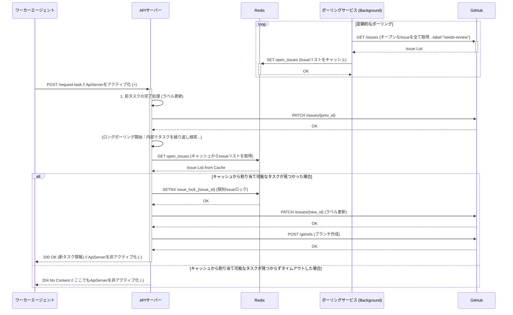

# System Design Details

**Note:** This file contains detailed system design information (sequence diagrams, robustness notes) that was previously in `system_context.md`. It is preserved here for reference.

## システム詳細シーケンス図 (Legacy)

----

#### 8. 堅牢性のための設計

  * **GitHub APIの特性への対応:**
      * **ブランチが既に存在する場合 (`422 Reference already exists`) はエラーとせず、処理を続行する。**

----

#### 9. 技術スタック（推奨）
