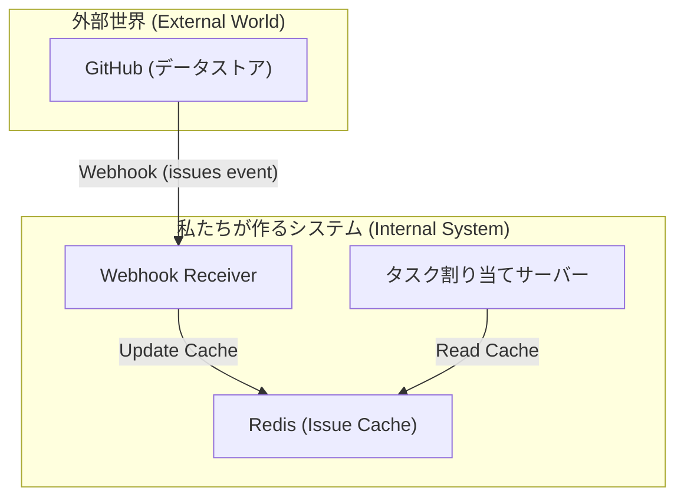
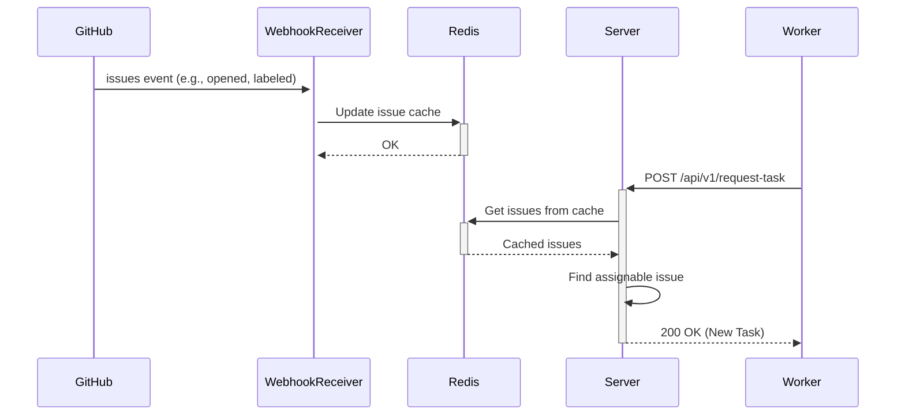

# Webhook-Based Architecture for Scalable Issue Fetching

## 1. 背景 (Background)

現在のIssue全件取得方式（`get_open_issues`）は、リポジトリのIssue数が増加した際にパフォーマンスが劣化するという既知の技術的負債を抱えています。このままでは、将来的にシステムの応答時間が著しく悪化し、実用性が損なわれる可能性があります。

## 2. 目的 (Goal)

現在の全件取得方式に代わる、よりスケーラブルなIssue取得アーキテクチャを調査・設計します。具体的には、GitHub Webhookを活用してIssueの作成・更新イベントをリアルタイムに受信し、システムのローカルキャッシュ（Redis等）と同期する方式を検討します。これにより、APIリクエスト毎のGitHubへの問い合わせを最小限に抑え、将来のパフォーマンスボトルネックを解消します。

## 3. 新しいアーキテクチャの概要

新しいアーキテクチャは、以下のコンポーネントで構成されます。

*   **GitHub Webhook:** `issues` イベントをリッスンし、Issue の変更をリアルタイムで通知します。
*   **Webhook Receiver:** GitHubからのWebhookイベントを受信し、パースする新しいエンドポイントです。
*   **Issue Cache:** Redis を使用して、Issue の情報をキャッシュします。
*   **Task Service:** タスクを要求する際に、GitHub API の代わりに Issue Cache を参照します。

### 3.1. コンポーネント図

### 3.2. シーケンス図

## 4. 詳細設計

### 4.1. Webhook の設定

GitHub のリポジトリ設定で、新しい Webhook を作成します。

*   **Payload URL:** `https://<your-server-address>/api/v1/webhook/github`
*   **Content type:** `application/json`
*   **Secret:** Webhook の正当性を検証するためのシークレットキー。
*   **Which events would you like to trigger this webhook?**
    *   `issues`

### 4.2. Webhook Receiver

`interface/api.py` に新しいエンドポイントを追加します。

*   **エンドポイント:** `POST /api/v1/webhook/github`
*   **説明:** GitHub からの `issues` イベントを受信し、Issue Cache を更新します。
*   **処理フロー:**
    1.  リクエストの `X-Hub-Signature-256` ヘッダーを検証し、リクエストが GitHub からのものであることを確認します。
    2.  リクエストボディをパースし、`action` プロパティに応じて処理を分岐します。
    3.  `opened`, `reopened`, `edited`, `labeled`, `unlabeled`, `assigned`, `unassigned` の場合に、Redis の Issue Cache を更新します。
    4.  `closed` の場合に、Redis の Issue Cache から該当する Issue を削除します。

### 4.3. Issue Cache (Redis)

Redis の Hash を使用して、Issue の情報を格納します。

*   **キー:** `issue:<issue_id>`
*   **フィールド:**
    *   `title`: Issue のタイトル
    *   `body`: Issue の本文
    *   `labels`: Issue のラベル (JSON 文字列)
    *   `assignee`: Issue の担当者 (JSON 文字列)
    *   その他、タスク割り当てに必要な情報

### 4.4. Task Service の変更

`application/task_service.py` の `request_task` メソッドを修正します。

*   **変更前:** `github_client.get_open_issues()` を呼び出し、すべてのオープンな Issue を取得する。
*   **変更後:** Redis の Issue Cache からすべての Issue を取得する。

## 5. メリット・デメリット

### 5.1. メリット

*   **スケーラビリティ:** Issue 数が増加しても、タスク割り当てのパフォーマンスが劣化しません。
*   **リアルタイム性:** Issue の変更がリアルタイムでシステムに反映されます。
*   **GitHub API の負荷軽減:** GitHub API へのリクエスト数を大幅に削減できます。

### 5.2. デメリット

*   **実装の複雑性:** Webhook の受信処理やキャッシュの管理など、実装が複雑になります。
*   **データの整合性:** Webhook の受信に失敗した場合など、キャッシュと GitHub のデータに不整合が発生する可能性があります。

## 6. 技術的課題と対策

*   **Webhook の受信失敗:**
    *   **課題:** ネットワークの問題などで Webhook の受信に失敗した場合、キャッシュが更新されません。
    *   **対策:** 定期的に GitHub API を呼び出して、キャッシュとデータを同期するバッチ処理を実装します。
*   **大量の Webhook イベント:**
    *   **課題:** Issue のラベル一括変更など、短時間に大量の Webhook イベントが発生した場合、サーバーに負荷がかかる可能性があります。
    *   **対策:** Webhook Receiver でイベントをキューイングし、非同期に処理するなどの対策を検討します。
