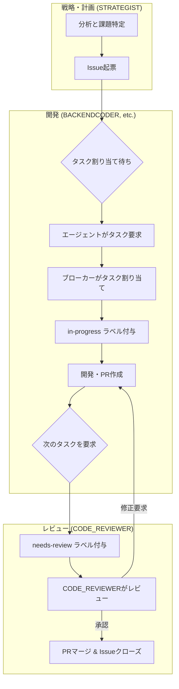

# エンドツーエンド開発ワークフロー

このドキュメントは、本プロジェクトにおけるタスク（Issue）が、起票されてから完了（マージ）するまでのライフサイクル全体を定義します。

Issueの階層構造（Epic/Story/Task）や、それぞれの作成方法に関する詳細なガイドラインについては、[階層的要件管理ワークフロー](./requirement-management-workflow.md)を参照してください。

## ワークフローの全体像



---

## 開発環境のセットアップ

開発を始める前に、以下の手順で開発環境をセットアップしてください。

### 1. リポジトリのクローン

まず、プロジェクトのリポジトリをローカルにクローンします。

```bash
git clone https://github.com/masa-codehub/github_broker.git
cd github_broker
```

### 2. Python 依存関係のインストール

プロジェクトのPython依存関係をインストールし、開発モードでパッケージをセットアップします。`run.sh` スクリプトを使用するか、`pip install -e .` を直接実行してください。

```bash
# run.sh を使用する場合
./run.sh install

# または、直接 pip を使用する場合
pip install -e .
```

### 3. pre-commit フックの有効化

コミット前にコードの品質チェックを自動的に行うために、pre-commit フックを有効にします。

```bash
pre-commit install
```

### 4. 必要なツール

開発には以下のツールが必要です。事前にインストールしておいてください。

-   **Docker**: コンテナ化されたサービス（例: Redis）を実行するために必要です。
-   **gh CLI**: GitHub CLIツール。Issueの管理やPull Requestの操作に便利です。

---

## 各フェーズと担当エージェントの責任

### フェーズ0: 戦略と課題起票 (`STRATEGIST`)
1.  **分析と課題特定:** `STRATEGIST` は、プロジェクトのドキュメント、コード、Issueの進捗状況を常に監視し、あるべき姿と現状のギャップを分析します。
2.  **Issue起票:** 特定したギャップを解消するため、具体的な `Epic`, `Story`, `Task` を起票します。その際、既存のIssueとの関連性を調査し、適切に紐付けを行います。Issueには、完了条件、成果物、担当すべき役割（例: `BACKENDCODER`）のラベルを明確に付与します。

### フェーズ1: タスク割り当て (ブローカー)

1.  **エージェントからの要求:** いずれかのエージェントが、自身の`agent_id`と`agent_role`を付けて、ブローカーにタスクを要求します。
2.  **ブローカーによる選択:** ブローカーは、オープンなIssueの中から、エージェントの`agent_role`と一致するラベルが付いたものを探し出します。
3.  **タスクの割り当て:** 適切なIssueが見つかると、ブローカーはそのIssueに`in-progress`とエージェントIDのラベルを付与し、作業ブランチ名と共にエージェントに返却します。

### フェーズ2: 開発 (開発エージェント例: `BACKENDCODER`)

1.  **ブランチ作成:** エージェントは、指定されたブランチ名でローカルにブランチを作成し、開発を開始します。
2.  **実装:** Issueの完了条件に基づき、コードやドキュメントの作成・修正を行います。
3.  **コミット & プッシュ:** 作業が完了したら、変更内容をコミットし、リモートリポジトリにプッシュします。
4.  **Pull Request作成:** `main`ブランチに対してPull Requestを作成します。PRの本文には、`Closes #<issue番号>`というキーワードを含め、マージ時にIssueが自動でクローズされるように設定します。

### フェーズ3: レビュー (`CODE_REVIEWER`)

1.  **レビュー開始:** 開発エージェントが次のタスクを要求すると、ブローカーは前回のIssueから`in-progress`ラベルを剥がし、代わりに`needs-review`ラベルを付与します。
2.  **担当の特定:** `CODE_REVIEWER`エージェントは、`needs-review`ラベルの付いたIssue（および関連するPR）を自身のタスクとして認識します。
3.  **レビュー実施:** `CODE_REVIEWER`は、PRの変更内容を精査し、品質、規約、要求仕様への準拠などを確認します。
4.  **フィードバック:**
    -   **承認可能な場合:** GitHubのレビュー機能で「Approve」します。
    -   **修正が必要な場合:** 修正点を具体的に指摘するコメントと共に「Request changes」します。この場合、タスクは開発エージェントに差し戻され、**フェーズ2**に戻ります。

### フェーズ4: マージ (リポジトリ管理者)

1.  **マージ実行:** `CODE_REVIEWER`によって承認されたPull Requestを、リポジトリの管理者が`main`ブランチにマージします。
2.  **完了:** PRがマージされると、連携したIssueが自動的にクローズされ、一連のワークフローが完了します。

---

## 分析に基づくプロセスの課題と改善策

本ワークフローの分析を通じて、プロジェクトの進行を妨げる可能性のある以下の3つの課題（ボトルネック）が特定されました。

### 課題1: 設計と実装の乖離
- **問題:** ADR（アーキテクチャ決定記録）などで承認された設計変更が、即座に実装に反映されず、技術的負債として蓄積されるケースがありました。
- **対策:** `STRATEGIST` は、定期的にADRとコードベースの差分をチェックし、未実装の決定事項を実装するための `Task` を速やかに起票します。 (例: Issue #484)

### 課題2: Issueのトレーサビリティ欠如
- **問題:** 新規に作成された `Task` が、関連する上位の `Epic` や `Story` に紐付けられていない場合があり、タスクの目的や優先順位が不明確になることがありました。
- **対策:** `STRATEGIST` は、Issue起票時に必ず上位の目標との関連性を確認し、Issue本文に「このタスクは Epic #XXX の一部です。」といった記述を追加することで、トレーサビリティを確保します。 (例: Issue #484, #485 の更新)

### 課題3: プロジェクトの停滞（凪状態）
- **問題:** アクティブな進行中タスク (`in-progress`, `needs-review`) がないにも関わらず、バックログの優先タスクに誰も着手しない「凪」の状態が発生することがありました。
- **対策:** `STRATEGIST` は、進行中タスクが0件であることを検知した場合、`P0`, `P1` といった優先度の高いIssueの中から、依存関係がなく着手可能なタスクを特定し、担当役割のエージェントに開発開始を促します。 (例: Issue #391 の解決プロセス)
