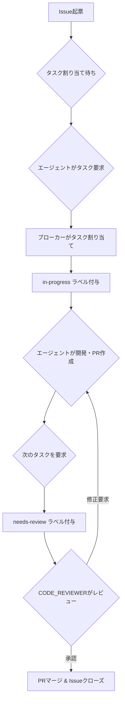

# エンドツーエンド開発ワークフロー

このドキュメントは、本プロジェクトにおけるタスク（Issue）が、起票されてから完了（マージ）するまでのライフサイクル全体を定義します。

## ワークフローの全体像

---

## 各フェーズの詳細

### フェーズ1: タスク割り当て (ブローカー)

1.  **エージェントからの要求:** いずれかのエージェントが、自身の`agent_id`と`agent_role`を付けて、ブローカーにタスクを要求します。
2.  **ブローカーによる選択:** ブローカーは、オープンなIssueの中から、エージェントの`agent_role`と一致するラベルが付いたものを探し出します。
3.  **タスクの割り当て:** 適切なIssueが見つかると、ブローカーはそのIssueに`in-progress`とエージェントIDのラベルを付与し、作業ブランチ名と共にエージェントに返却します。

### フェーズ2: 開発 (開発エージェント)

1.  **ブランチ作成:** エージェントは、指定されたブランチ名でローカルにブランチを作成し、開発を開始します。
2.  **実装:** Issueの完了条件に基づき、コードやドキュメントの作成・修正を行います。
3.  **コミット & プッシュ:** 作業が完了したら、変更内容をコミットし、リモートリポジトリにプッシュします。
4.  **Pull Request作成:** `main`ブランチに対してPull Requestを作成します。PRの本文には、`Closes #<issue番号>`というキーワードを含め、マージ時にIssueが自動でクローズされるように設定します。

### フェーズ3: レビュー (CODE_REVIEWER)

1.  **レビュー開始:** 開発エージェントが次のタスクを要求すると、ブローカーは前回のIssueから`in-progress`ラベルを剥がし、代わりに`needs-review`ラベルを付与します。
2.  **担当の特定:** `CODE_REVIEWER`エージェントは、`needs-review`ラベルの付いたIssue（および関連するPR）を自身のタスクとして認識します。
3.  **レビュー実施:** `CODE_REVIEWER`は、PRの変更内容を精査し、品質、規約、要求仕様への準拠などを確認します。
4.  **フィードバック:**
    -   **承認可能な場合:** GitHubのレビュー機能で「Approve」します。
    -   **修正が必要な場合:** 修正点を具体的に指摘するコメントと共に「Request changes」します。この場合、タスクは開発エージェントに差し戻され、**フェーズ2**に戻ります。

### フェーズ4: マージ (リポジトリ管理者)

1.  **マージ実行:** `CODE_REVIEWER`によって承認されたPull Requestを、リポジトリの管理者が`main`ブランチにマージします。
2.  **完了:** PRがマージされると、連携したIssueが自動的にクローズされ、一連のワークフローが完了します。
