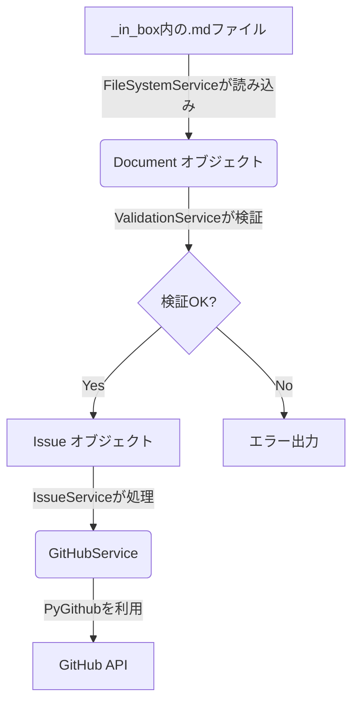

# データモデル定義書 (`issue_creator_kit`)

このドキュメントは、`issue_creator_kit`のドメイン層で定義・利用される主要なデータモデルについて説明します。

## ドメインモデル

### `Document`

-   **定義場所:** `issue_creator_kit/domain/document.py`
-   **責務:** `_in_box`に配置された単一のMarkdown計画ファイル（`.md`）を表現するドメインエンティティです。このモデルは、ファイルの内容を構造化データとして保持し、検証の対象となります。
-   **主要プロパティ:**
    -   `path`: `Path` - ファイルへのパス。
    -   `front_matter`: `dict` - YAMLフロントマターをパースした辞書。
    -   `content`: `str` - Markdownの本文。
    -   `issue_type`: `IssueType` (Enum) - `epic`, `story`, `task` のいずれか。
    -   `parent_path`: `Path | None` - 親となる計画ファイルのパス。階層構造の解析に使用されます。

### `Issue`

-   **定義場所:** `issue_creator_kit/domain/issue.py`
-   **責務:** `Document`モデルから変換された、GitHubに起票されるべき単一のIssueの情報を表現するドメインエンティティです。
-   **主要プロパティ:**
    -   `title`: `str` - Issueのタイトル。
    -   `body`: `str` - Issueの本文。
    -   `labels`: `list[str]` - Issueに付与されるラベル。
    -   `issue_type`: `IssueType` (Enum)
    -   `parent`: `Issue | None` - 親Issueへの参照。

## モデル間の関係とデータフロー

ツールの主要なデータフローは、`Document`から`Issue`への変換です。

1.  `FileSystemService`が`_in_box`から`.md`ファイルを探索し、それぞれを`Document`オブジェクトとしてインスタンス化します。
2.  `ValidationService`が各`Document`オブジェクトを検証します。
3.  `IssueService`が検証済みの`Document`オブジェクトを受け取り、`Issue`オブジェクトへと変換します。この際、親子関係も解決されます。
4.  最終的に、`IssueService`は`GitHubService`を呼び出し、`Issue`オブジェクトの情報に基づいてGitHub API経由で実際のIssueを作成します。
