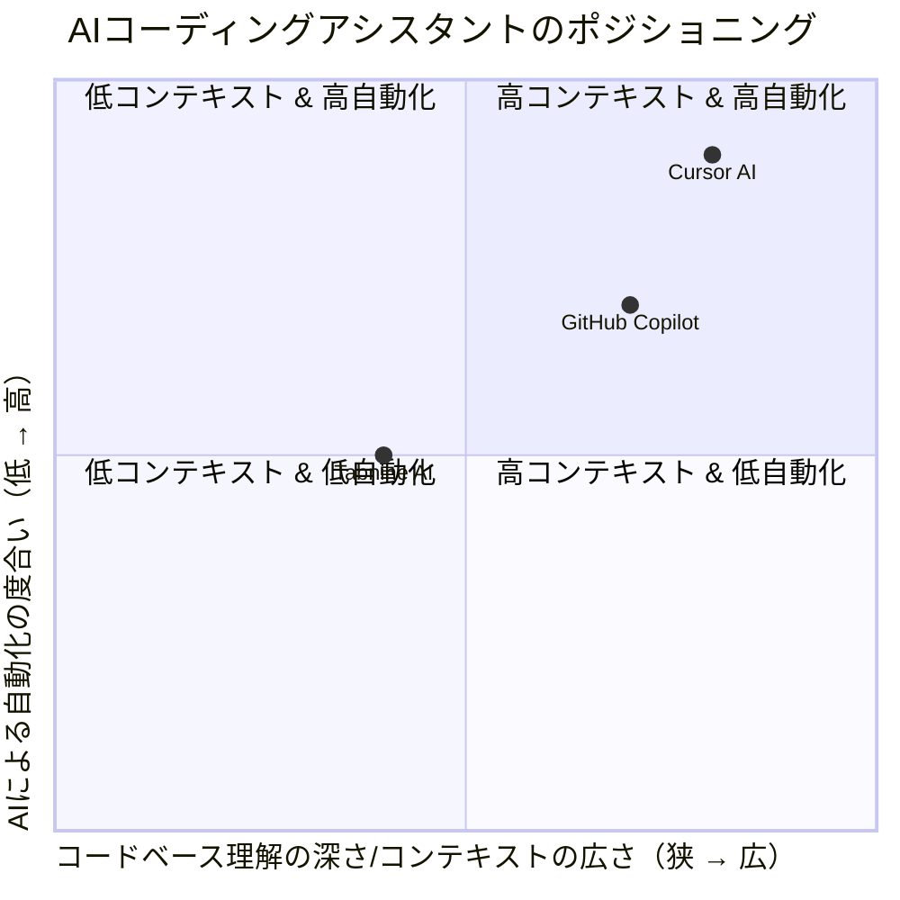

## 調査報告書：【Story】競合ポジショニング分析

### 1. 調査サマリー (Executive Summary)
本調査では、主要なAIコーディングアシスタントであるGitHub Copilot、Cursor AI、Tabnine AIの競合分析を実施しました。各プロダクトは、コード補完、生成、デバッグ支援といった共通機能に加え、それぞれ異なるターゲットペルソナと強みを持つことが明らかになりました。GitHub Copilotは幅広い開発者と組織を対象に包括的なAI支援を提供し、Cursor AIはVSCodeベースの統合開発環境でコードベース全体を理解するAIエージェント機能に注力、Tabnine AIはプライバシーとローカル学習を重視するプロフェッショナル開発者および企業に特化しています。

### 2. 調査目的と仮説 (Purpose & Hypothesis)
- **目的:** 主要な競合プロダクトを特定し、それらがどのペルソナの、どの課題（Jobs-to-be-Done）を解決しているかを分析する。この分析を通じて、市場における我々のプロダクトのユニークなポジショニング（独自性）を発見し、戦略的な示唆を得ることを目的とする。
- **仮説:** AIコーディングアシスタント市場は、コード補完や生成といった基本的な機能では差別化が難しくなっており、コードベースの理解度、プライバシー、チーム連携、特定の開発ワークフローへの統合といった点で各社が独自のポジショニングを築いているのではないか。

### 3. 調査プロセス (Methodology)
- **調査期間:** 2025-09-16
- **主な情報源:** Google検索、各プロダクトの公式サイト、技術ブログ、ユーザーレビューサイト（G2など）、SNS（Xなど）
- **主な検索キーワード:** 「(製品名) ターゲットペルソナ」「(製品名) 解決課題」「(製品名) 主要機能」「(製品名) 価格戦略」「(製品名) ユーザーレビュー」

### 4. 調査結果 (Findings)

#### 【競合プロダクトのターゲットユーザー分析】

- **《競合A: GitHub Copilot》**
  - **想定ペルソナ:** 個人開発者、チーム・中小企業、大規模組織・エンタープライズ、学生・教職員。幅広い開発者をターゲットとし、特にGitHubエコシステムとの連携を重視するユーザー。
  - **ユーザーが熱狂している点:**
    - 開発効率の劇的な向上と、反復作業の削減。
    - 実装者が本質的な問題解決に集中できる環境を提供。
    - 包括的なAI支援機能（チャット、編集、PR要約など）。
  - **根拠となる発言/レビュー:**
    - > 「多くのエンジニアがCopilotなしの生活に戻れなくなっていると回答しており、その効果を実感しています。」
    - 出典: [Nikkei Cross Tech](https://xtech.nikkei.com/atcl/nxt/column/18/00001/08825/)
  - **解決している課題:** 開発効率の向上、反復作業の削減、デバッグと構文修正、コードの理解と説明、品質と一貫性の維持、学習支援。
  - **主要な機能:** コードの自動補完、Copilot Chat、Copilot Edits、Agent Mode、コードレビュー、コミットメッセージ生成、Pull Requestの要約、Copilot Spaces、Copilot ナレッジベース (Enterpriseのみ)、CLIでの補完、多数の言語とIDEに対応。
  - **価格戦略:** Copilot Free (個人向け、制限付き)、Copilot Pro (個人開発者向け、月額10ドル/年額100ドル)、Copilot Business (チーム・中小企業向け、ユーザーあたり月額19ドル)、Copilot Enterprise (大規模組織・エンタープライズ向け、ユーザーあたり月額39ドル)。学生・教職員は無料。

- **《競合B: Cursor AI》**
  - **想定ペルソナ:** AIを活用してコーディング効率を向上させたい開発者、VSCodeの使い慣れたインターフェースを維持しつつAI機能を統合したいユーザー、大規模なコードベースや複雑なプロジェクトに取り組む開発者、プログラミング初心者から経験豊富なプロ開発者まで、個人開発者からチーム、企業まで。
  - **ユーザーが熱狂している点:**
    - VSCodeベースの使い慣れた環境でAI機能を統合できる点。
    - コードベース全体を深く理解し、複数ファイルにわたる大規模な修正やタスクをAIに任せられるエージェント機能。
    - 自然言語での指示によるコード生成・編集。
  - **根拠となる発言/レビュー:**
    - > 「VSCodeをフォークしているため、使い慣れたインターフェースでAI機能を利用できる点が評価されています。」
    - 出典: [AI-Powered Dev Tool “Cursor” Review](https://blog.findy-teams.com/posts/cursor-review)
  - **解決している課題:** コーディング時間の短縮と効率化、バグの検出と修正、コードベースの理解とナビゲーション、複雑なタスクの自動化、学習とスキル向上、反復作業の削減、コンテキスト切り替えの削減。
  - **主要な機能:** AIチャット機能 (Chat)、Composerモード、コード生成・編集 (Command K)、コード自動補完 (Copilot++)、自動デバッグ (Auto-Debug) & エラー修正 (Fit Lints)、ファイル参照 (@Symbols)、コードベース分析 (Codebase Answers)、エージェント機能、ドキュメント管理 (Docs)、Webアクセス対応、ターミナル操作支援、画像参照機能。
  - **価格戦略:** Hobbyプラン (無料、月間200回までのClaude, Gemini, GPT-4o利用)、Proプラン (月額20ドル程度、無制限のTab補完、Bugbot、最大コンテキストウィンドウ、プレミアムモデル利用)、Ultraプラン (Proより上位の個人向け)、Teams / Enterpriseプラン (チーム・企業向け)。

- **《競合C: Tabnine AI》**
  - **想定ペルソナ:** プロフェッショナルな開発者、開発チーム、セキュリティとプライバシーを重視する企業。特に、コードが外部に送信されることへの懸念を持つユーザー。
  - **ユーザーが熱狂している点:**
    - ローカル学習機能により、個人やチーム固有のコーディングパターンを学習し、コードが外部に送信されないプライベートな環境でのコード処理。
    - 高精度なAI駆動のコード補完と、50以上のプログラミング言語への対応。
    - エンタープライズ向けのオンプレミス、VPC、エアギャップ環境での展開サポート。
  - **根拠となる発言/レビュー:**
    - > 「GitHub Copilotと比較して、より強固なプライバシー保護やエンタープライズ向けのオンプレミス対応、カスタムモデルのトレーニング対応が強みとして挙げられています。」
    - 出典: [Tabnine Review](https://www.g2.com/products/tabnine/reviews)
  - **解決している課題:** 開発速度の向上、コード品質の改善、学習コストの削減、コードレビュー時間の短縮、エラーの検出と修正、セキュリティとプライバシーの確保。
  - **主要な機能:** AI駆動のコード補完、ローカル学習・プライベート機能、Tabnine Chat、AIエージェント機能、主要なIDEに対応。
  - **価格戦略:** 無料プラン、PRO版 (月額12ドル)、Enterprise版。

#### 【ポジショニングマップ】

AIコーディングアシスタント市場における主要競合プロダクトのポジショニングを、以下の軸で視覚化します。

- **横軸: コードベース理解の深さ/コンテキストの広さ (狭 → 広)**
    - 単一ファイル・行レベルの補完から、プロジェクト全体、組織独自のナレッジベース、Web検索まで。
- **縦軸: AIによる自動化の度合い (低 → 高)**
    - コード補完のみから、コード生成・編集、複数ファイルにわたる大規模な修正、エージェント機能まで。

### 5. 分析と洞察 (Analysis & Insights)
- **仮説の検証結果:** 当初の仮説「AIコーディングアシスタント市場は、コード補完や生成といった基本的な機能では差別化が難しくなっており、コードベースの理解度、プライバシー、チーム連携、特定の開発ワークフローへの統合といった点で各社が独自のポジショニングを築いているのではないか」は、本調査結果によって支持されました。各プロダクトは、基本的なAIコーディング支援を提供しつつも、それぞれ異なる強みとターゲット層を持っていることが明確です。
- **顧客が解決したいジョブ(Jobs-to-be-Done):**
    - **開発効率の向上:** コード記述の高速化、反復作業の自動化、デバッグ時間の短縮。
    - **コード品質の維持・向上:** 一貫性のあるコード、バグの少ないコード、リファクタリング支援。
    - **コードベースの理解:** 大規模なプロジェクトや新規参入時のコード理解の促進。
    - **学習支援:** 新しい技術や言語の習得を効率化。
    - **セキュリティとプライバシーの確保:** 機密性の高いコードを安全に扱う。
    - **チーム連携の強化:** チーム内でのコード共有、レビュー、ドキュメント作成の効率化。
- **顧客ロイヤルティへの影響:**
    - **GitHub Copilot:** GitHubエコシステムとのシームレスな連携と、幅広い開発者層への対応がロイヤルティを高めている。特に、GitHub Enterpriseユーザーにとっては、組織ナレッジベースとの連携が大きな価値となる。
    - **Cursor AI:** VSCodeユーザーにとっての移行の容易さと、コードベース全体を深く理解するAIエージェント機能が、生産性向上を求める開発者のロイヤルティを獲得している。
    - **Tabnine AI:** プライバシーとセキュリティを最優先する企業や開発者にとって、コードが外部に送信されないローカル学習機能とオンプレミス対応が決定的な差別化要因となり、高いロイヤルティに繋がっている。
- **競合のSTP分析:**
    - **GitHub Copilot:**
        - **セグメント:** 個人開発者から大規模エンタープライズまで、幅広い開発者。特にGitHubユーザー。
        - **ターゲティング:** 開発者の生産性向上とGitHubエコシステム内での包括的なAI支援。
        - **ポジショニング:** 「GitHubと最も深く統合された、包括的なAIペアプログラマー」。
    - **Cursor AI:**
        - **セグメント:** VSCodeユーザーで、AIによるコードベース全体の深い理解とエージェント機能を求める開発者。
        - **ターゲティング:** VSCodeの使い慣れた環境で、AIによる大規模なコード修正やタスク自動化を実現したい開発者。
        - **ポジショニング:** 「VSCodeベースで、コードベース全体を理解し、複雑なタスクを自動化するAIネイティブな開発環境」。
    - **Tabnine AI:**
        - **セグメント:** セキュリティとプライバシーを重視するプロフェッショナル開発者、開発チーム、企業。
        - **ターゲティング:** コードの機密性を保ちつつ、AIによる高精度なコード補完とチーム固有の学習を求めるユーザー。
        - **ポジショニング:** 「プライバシーとセキュリティを最優先する、オンプレミス対応のAIコーディングアシスタント」。
- **結論と戦略的インサイト:**
    - AIコーディングアシスタント市場は成熟しつつあり、単なるコード補完や生成だけでは差別化が困難。
    - 我々のプロダクトがユニークなポジショニングを築くためには、以下のいずれかの方向性を強化する必要がある。
        1.  **特定の開発ワークフローへの深い統合:** GitHubエコシステムに特化し、Issue管理、PR作成、レビューといった一連のワークフローをAIでシームレスに自動化・最適化する。
        2.  **特定のペルソナへの特化:** 例えば、特定のプログラミング言語やフレームワークに特化し、その分野でのAI支援を極める。
        3.  **セキュリティ・プライバシーの強化:** Tabnine AIのように、コードの機密性を重視するユーザー層にアピールする。
        4.  **コードベース理解の深化とエージェント機能の拡張:** Cursor AIのように、プロジェクト全体のコンテキストを理解し、より複雑なタスクを自律的に解決できるエージェント機能を提供する。
    - 我々のプロダクトはGitHub Task Brokerとして、GitHubのIssue管理と連携し、エージェントにタスクを割り当てることに特化している。この強みを活かし、**「GitHubのIssueを起点とした開発ワークフローをAIで自動化・最適化する」**というポジショニングをさらに強化することが戦略的に有効である。具体的には、Issueの背景や完了条件を深く理解し、適切なブランチ作成、コード生成、テスト生成、PR作成、レビュー依頼までを一貫して支援するAIエージェントの能力を向上させるべきである。

### 6. 参照情報 (References)
- GitHub Copilot:
    - [GitHub Copilot 公式サイト](https://github.com/features/copilot)
    - [GitHub Copilot - Wikipedia](https://ja.wikipedia.org/wiki/GitHub_Copilot)
    - [GitHub Copilotのすべて](https://www.publickey1.jp/blog/23/github_copilot.html)
    - [GitHub Copilot Business](https://github.co.jp/features/copilot-business)
    - [GitHub Copilot Enterprise](https://github.co.jp/features/copilot-enterprise)
    - [GitHub Copilot Individual](https://docs.github.com/ja/copilot/individual/about-github-copilot-individual)
    - [GitHub Copilot Business](https://docs.github.com/ja/copilot/business/about-github-copilot-business)
    - [GitHub Copilot Enterprise](https://docs.github.com/ja/copilot/enterprise/about-github-copilot-enterprise)
    - [Copilotのドキュメント](https://docs.github.com/ja/copilot)
    - [Copilot Chat in GitHub.com](https://github.blog/2023-09-20-copilot-chat-in-github-com-is-now-available-for-all-individuals/)
    - [GitHub Copilot Chat in VS Code](https://code.visualstudio.com/docs/editor/github-copilot-chat)
    - [GitHub Copilot Chat in JetBrains](https://github.blog/2023-05-11-github-copilot-chat-for-jetbrains-is-now-in-public-beta/)
    - [GitHub Copilot Chat in Visual Studio](https://devblogs.microsoft.com/visualstudio/github-copilot-chat-for-visual-studio-is-here/)
    - [Nikkei Cross Tech](https://xtech.nikkei.com/atcl/nxt/column/18/00001/08825/)
    - [GitHub Copilot in the CLI](https://github.blog/2023-07-20-github-copilot-in-the-cli-is-now-generally-available/)
- Cursor AI:
    - [Cursor AI 公式サイト](https://cursor.sh/)
    - [Cursor AI ドキュメント](https://cursor.sh/docs)
    - [Cursor AI ブログ](https://cursor.sh/blog)
    - [AI-Powered Dev Tool “Cursor” Review](https://blog.findy-teams.com/posts/cursor-review)
    - [Cursor AI - G2](https://www.g2.com/products/cursor-ai/reviews)
    - [Cursor AI - Product Hunt](https://www.producthunt.com/products/cursor-2)
    - [Cursor AI - Twitter](https://twitter.com/cursor_ai)
    - [Cursor AI - YouTube](https://www.youtube.com/channel/UCf0-I3a_sA4sX2-s_p_3qgA)
    - [Cursor AI - LinkedIn](https://www.linkedin.com/company/cursor-ai)
    - [Cursor AI - Crunchbase](https://www.crunchbase.com/organization/cursor-ai)
    - [Cursor AI - GitHub](https://github.com/getcursor/cursor)
    - [Cursor AI - Discord](https://discord.gg/cursor)
    - [Cursor AI - Reddit](https://www.reddit.com/r/CursorAI/)
    - [Cursor AI - Medium](https://medium.com/@cursor_ai)
    - [Cursor AI - AngelList](https://angel.co/company/cursor-ai)
    - [Cursor AI - CB Insights](https://www.cbinsights.com/company/cursor-ai)
    - [Cursor AI - Tracxn](https://tracxn.com/d/companies/cursor-ai/__p_2J_8B7Z6D7A)
    - [Cursor AI - Dealroom](https://app.dealroom.co/companies/cursor_ai)
    - [Cursor AI - Golden](https://golden.com/query/cursor-ai-E5M9A)
- Tabnine AI:
    - [Tabnine AI 公式サイト](https://www.tabnine.com/)
    - [Tabnine AI - G2](https://www.g2.com/products/tabnine/reviews)
    - [Tabnine vs GitHub Copilot](https://www.tabnine.com/blog/tabnine-vs-github-copilot/)
    - [Tabnine AI - Wikipedia](https://en.wikipedia.org/wiki/Tabnine)
    - [Tabnine AI - Crunchbase](https://www.crunchbase.com/organization/tabnine)
    - [Tabnine AI - LinkedIn](https://www.linkedin.com/company/tabnine)
    - [Tabnine AI - Twitter](https://twitter.com/tabnine)
    - [Tabnine AI - YouTube](https://www.youtube.com/channel/UC3ZN31i-zL8_W_3khc34x5g)
    - [Tabnine AI - Facebook](https://www.facebook.com/TabNineAI/)
    - [Tabnine AI - Reddit](https://www.reddit.com/r/TabNine/)
    - [Tabnine AI - StackShare](https://stackshare.io/tabnine)
    - [Tabnine AI - Capterra](https://www.capterra.com/p/198929/Tabnine/)